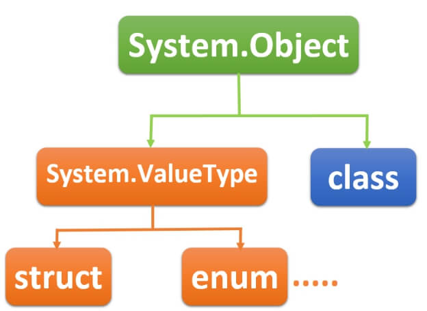

# C# OOP Ultimate Guide Project Master Class 💻 📚 📝
Welcome to the c# master class notes. Nothing here but lovingly crafted notes for personal use. Summarized and formatted by yours truly. A highly recommended [C# Masterclass - Harsha Vardhan](https://www.udemy.com/course/c-sharp-oop-ultimate-guide-project-master-class/) for anyone interested in c#.

- What 🤔:
.net it is not a single language. It's an application dev platform to build desktop, web and mobile. Calculator, Supermarket app (may or may not integrate with web) standalone. Web apps live on a server and usually interact with a database. Mobile apps are installed on phones. It is a technology to develop applications. It's a free development platform since 2002. They will not execute directly on the operating system. It runs on a component called CLR. .net supports more than 30 languages. C#, VB, VC++ etc.

- Why 🤷‍♀️: 
Secured execution environment 🔒
Wide variety of applications and languages 🌎
Code reusability 🔁

Modules and apps 📦:

**ASP.net** Websites (static collection of websites), Web Applications (dynamic web content), Web Services (Reusable programs on the web)
**C#.net** Windows GUI apps, Windows Services (no GUI components), Console Applications (CLI apps in command prompt window)

*These must be installed on the user machine* 💻

---

## 10 Common Language Infrastructure
c# application source is written by dev 🧑‍💻
Ultimately we need to convert to "Native Machine Code" 🖥️
Intermediate languages are (Language Neutral) 🌐
CLR is an execution language (Execution Engine of all .net modules) 🚀
Native Machine code is operating system-specific language (Executed by OS) 💻
**c# application source code** -> compiler -> **Intermediate language** -> **Common Language Runtime** -> **Native Machine Code** 

In VS you can hit the start button to compile to IL. So for c#, we have a c# compiler 
You can open the project in file explorer and check out an .exe
You can see the source of this by typing the command `ildasm` intermediate language disassembler located in /bin/debug

---

## Common Language Runtime
THis is the most important componenet in .net

CLR:
"Execution environment" for all .net languages. 
Code execution env that executes all types of .net 
Applications develoier in any .net language runes based on "CLR" only
CLR is part of .net framework pre-installed on windows

#### Components of CLR:
Class Loader, Exception Manager, Memory Manager, Garbage collector, JIT Compiler, Thread Manager, Security Manager

1. Class Loader
 - Loading classes from compiled source code to memory
 - Loads a class, when it is needed (before creating objec)
2. Memory Manager
 - Allocating necessary memory for objects 
 - When an object is created in teh code, certain amount of memory will be allocated for the oject in applications "heap"
3. Garbage Collector
 - Freeing (deleting) memory of objects
 - Identifies all unreferenced objects adn delete them in memory (RAM)
4. JIT (Just In Time) compiler 
 - Convert the MSIL code into Native Machine Language
 - Compiles the code of a class when it is needed (before executing that particular class)
5. Exception manager
 - Raise notifications while run-rime errors
 - Creates exception logs
6. Thread Manager
 - Create threads (background process) to exectute the code
 - Entire program is treated as "Main thread"
 - Developer can create sub threads (child threads) to do background processes
7. Security manager
 - Verifies whether the appliation has permision to access resource or not
 - Before execturing the app it verifies whether the application has not attacked by malicius programs & has necessary permissins to access files / folders and hardware resources

---

## .net Framework Architecture
 
Is a combo of Common Language Runtime (Runtime engine) + Framework Class Library (OOP collection of classes used to develop apps)

Learning about availbable components can be found in the .net framework arhciteture. 

CLS (Common Language Specification)

FCL is comprised of: Win forms, ASP.net, WPF, ADO.et, Base Class Library, Common Language Runtime

#### BCL (Base Class Library)

> Contains a set of predefined classes that can be used in all types of .net applications & langugages. for general I/O operations, type conversion, creation of threads etc. 

 Ex: 
  - Console
  - String 
  - StringBuilder
  - Convert
  - Thread
  - Task
  - etc

#### ADO.net

> Contains a set of pre-defined classes that can be used in all types of .net applications & languages for connecting to databases, inserting, updating, deleting. 

Ex:
 - SqlConnection
 - SqlCommand
 - SqlDataAdapter
 - SqlDataReader
 - etc

#### Win Forms 

> Contains a set of pre-defined classes taht can be used in windows gui applications for dev of gui elements such as form, textboc, button, checkbox etc

Ex:
 - Form
 - Label
 - Button
 - TextBox
 - etc

#### WPF (Windows Presentation Foundation)

> Contains a set of prededifined classes that can be used in Ricch Windows GUI applications for dev of GUI elements. Such as window, textbox, button, checkbox, radio button

Ex:
 - Window label
 - Button 
 - Textbox 
 - etc

##### Asp (Active Server Pages) 

>  Contains a set of pre-defined calsses that can be used in Web Apps for dev of gui elements, such as page, textbox, button, checkbox, radio button etc

Ex:
 - Page
 - Label
 - Button
 - TextBox
 - etc

#### CLS (Common Language Specification)

> Contains a set of rules (concepts) that are common to all .net languages such as c#.net, Vb.net etc. By following practical implementation you may not need to worry too much about this. 

- Common rules of CLS:
 - CTS (Common type system) : Contains datatypes such as Int32, Int64, Single, Double etc
 - Classes & objects
 - Reference Variables
 - Method Parameters
 - Generics

 > These datatypes help fluid translation between .net languages

## Versions of .net 

.net 4.6.1 core

SHA-2, Elliptic Curve Cryptography API
64 bit JIT compiler for managed code
Introduction of .NET Core
 - (Multiplatoform support for windows, LINUX,Mac, Android, IOS)

---

## .net Core

> We can say .net has two flavors  *.net framework* (only windows) and *.net core*

- Introduced in 2016
- Microsofts application dev platofrom t for any desktop, mobile and embedded (iot)
- Supports Various OS
- Versions 1.0 - 3.1
- Mainly used in Xamarin & ASP.net Core
- Open Source (via MIT licence)
- Contains the class library which is a subset of .NET Framework
- Doesnt contain any windows specific classes / run time services
- c# / vb.net can be used for writing code of .NET Core 

---

## Visual Studio 

Visual Studio 2015 supports .NET framework 4.6.1 

Visual Studio 2022 supports (2021)
🔹 .NET framework 4.6.1 - 4.6
🔹 .NET Core 2.1, 3.1
🔹 .NET 5.0 - 6.0 

---

## Introduction to c#

🔸 What: Developed in 2002 for COnsole Apps, WIndows GUI and Windows Services.

🔸 Features: 
 - OOP Langguage
 - Case Sensitve
 - Strongly Typed Lang
 - Compiler based lang
 - Compiled based on CLI, executed by CLR
 - Developed by Anders Hejlsberg

---

## Introduction to Objec, Class, Fields & Methods ()

🔸 Objects:

- Things that exist in the real world (small unit) or entity

🔸 Classes:
> 2 types class based or prototype 
- c# is a class based oop language
- A class is a model of objects
- class isnt a collection of objects

🔸 Methods:
- Are a collection of statements to perform certain operations
- Are not stored in the object but associated

---

## Introducing Namespaces

> Is a collections of classes, made for grouping: All classes for *student, lecturer, staff* may belong to a namespace called *university*

We can access like `namespace.class` or a more pracitcal example `university.student`

Namespaces are included on top usually

---

## Language Tokens

 The list of words available in a language: Keywords, Operators, Literals (), Identifiers ()

🔸 Keywords: *always lower case*

🔸 Operators: *see language tokens*

🔸 Literals: Are *fixed values*: String, Bool( true or false) , integer etc. Requires no declaration

> **Character literals** should be in '' like `'a', '\''` 
> **String literals** should be in ""

🔸 Identifiers: All types of names (variable names, class names, field names, property names, method names etc)

## Versions of c#

🔹 Latest versions are 9 / 10

🔹 5.0 

- Async and Await

🔹 7.2
- private protected access modifier
- in parameter modifier

🔹 7.3 
- == 

🔹 8.0:

- Readonly structs
- Switch expressions
- Using Declarations
- Static Local Functions

- Default interface methods.
- Nullable reference types.
- Pattern matching enhancements.
- Asynchronous streams / Asynchronous disposable.
- Using declarations.
- Enhancement of interpolated verbatim strings.
- Null-coalescing assignment.
- Static local functions.

---

## Naming Conventions

🔸 camelCase:
For all local variables and parameters

🔸 PascalCase:
For all class names, structure names, namespace names, field names, method names, property names.

🔸 IPascaleCase:
For all interface names

🔸 _camelCase:
For all private fields

---

## Installing Visual Studio 2022

For practice purposes:

🔸 **community** version will suffice
🔸 **Professional** requires a licence fee
🔸 **Enterprise** is for large businesses of < 100 employees

For this course we only need VS Community version with component 

- *.NET desktop development* & *ASP.NET and web development may also be usefull*

Visit also individual components its a good idea to include all .NET runtime & .NET Framework dev tools, sdk etc so you can test further. 

- *Select all up to .NET framework 4.8 targeting pack* (This is optional but usefull).

Its nice to also *pin to taskbar*

Before you can use you will need to *sign in* with a microsoft account

---

## Creating first C# App 

Note the `Main` method inside a class
Main method should always be static void
`static` Static, in C#, is a keyword that can be used to declare a member of a type so that it is specific to that type. The static modifier can be used with a class, field, method, property, operator, event or constructor.
`void` means that the method doesnt return any value to the caller

~~~
class Sample {

        static void Main()
        {

                System.Console.WriteLine("Hi im in console");
                System.Console.ReadKey();

        }

}
~~~

---

## System Console Class

`Namespace.Classname.Method`
System is a namepsace
It is a static class
Console class is Base Class Library
`writeLine` goes to next line automatically

`Clear` empties the console
`ReadLine` accepts a string from keyboard, always returns string, even numbers are treated as string

---

## Variables
*Vary Able*
Are a named memory location in ram. 
All variables stored in stack
every method call a new Stack
variables value can be changed
The variables must be declared before usage
You cant change the type after execution

- Declaration `DataType VariableName;` 
- with init `DataType VariableName = value` - - overwriting `VariableName = newvalue;` -
- getting value `VariableName`

You *cant redeclare variable that is reseved as keyword*

---

## Primitive Types

Basically Predifined types. 
> A type specifies what type of value you want to store in memory. There are two two types: Primitive and non primitive. 

🔸 Primitive: (byte, short, int, bool) 
- Stictly a single value
- building blocks of none primitive types

🔸 Non-Primitive: (strings, classes)
- Stores one or more values
- Usually contains multiple members

- Sbyte = Small Byte is (0) by default
- Byte 8 bit *un-signed* int meaning it cant be negative

- Short is 16 bit and Ushort (again ushort is unsigned)

8 Bits is equal to 1 byte
- int is a large negative to positive number. you can get min value like *int.MinValue* | uint mostly same as int but unsigned meaining only positive

- long are 8 bytes of memory (very large datatype)

- float supports decimal types. default value is: `0F`
- double is a huuge floating point number default: `0D`
- decimal with a lot of decimal place can prefix with `0M` to define this datatype
- char supports all language characters. default:`\0` or null
- string (non prmitive) collection of unicode chars default value: null 
- bool either (true/false) default: `false`

> You can access the default value of a type `default(int)`

## Operator 

- Are a symbols to perform operation
- Recieve one or more operands (values) and returns one value

Classification: 
- Arithmetical (+,-,*)
- Assignment (=, +=,*=)
- Increment/Decrement (n++,++n,n--) 
- Comparison (==, !=,<,>)
- Logical (&,&&,|,||,!,^(Logical Exclusive))
- Concat ("string"+"string2")
- Ternary (?:,)

> Post incrementation n++ (first return value then increment)
Operators have a preference or order of evalutaion

## If, if-else, nested-if

Control statements are used to control the program execution flow. 
Used to make the execution flow jump forward

Conditional:
- if(simple-if, if-else, else-if,nested-if)
- switch-case

Looping:
- while
- do-while
- for

Jumping:
- goto
- break

## Break
In C#, the break statement is used to terminate a loop(for, if, while, etc.) or a switch statement on a certain condition.

## Continue

In C#, the continue statement is used to skip over the execution part of the loop

## Go to

The C# goto statement is also known jump statement. It is used to transfer control to the other part of the program

Not safe to use without an end condition

--- 

# Object Oriented Programing

For small and large projects 
Object is a single unit

## Undstanding OOP

~~~

class car {
        
 string regNo;
 string carModel
 
 int calculcateEmi(int carPrice, int nuOfMonths,in interestRate){

 }

}
~~~

## Classes & Objects

PascalCase for ClassNames

## AccessModifiers: 

- Fields, 
- Methods, 
- Constructors, 
- Properties, 
- Events, (raise notification to other classes)
- Deconstructors (clear unmanaged resources)

Can be:
- Internal (accesible within same assembly)
- Public (accesible in same and other assembly) ie: Internal class

Compiled source of a project is called an assembly (.exe) in form of Intermediate language

By default accessors are Internal

## Modifier:

- Static (belongs to the type itself rather than to a specific object)
- Abstract (the thing being modified has a missing or incomplete implementation)
- Sealed (cant be inherited)
- Partial (multiple partial classes that have same name are combined)

*These are all optional*

- Add Class: In vs *solution->add a new project* and select class library.net framework. *we can now access inside the class library from console app* 

- Reference: We can to add a reference to our second class. By going to our top class and selecting **add->reference projects and select your library** 

You can see on the right hand side all the main classes references. 

> Second class is not as accessible so we can set this to `internal`

The **stack** references variables from the heap
Objects are stored in the **heap** which is a grouping of all initialized objects

Since the object is nameless we need to create a reference.

### 1. Creating Reference Variable

`ClassName referenceVariable;`

~~~

class Sample {
        
    static void Main(){
        
        Customer c; //referenceVariable

    }

}
~~~

Default values of references are null

### 2. Creating Object and Store its Reference into the Reference Variable

`new Classname()`

~~~

class Sample {
        
    static void Main(){

        //referenceVariables: (all local by default)
        Customer c1, c2; 

         //Objects: Contain whatever properties we have defined in Customer
         new c1 = Customer(); //All these objects get stored in the heap only
         new c2 = Customer(); //2nd object
         // Note these new objects are nameless. For this we need the reference variable

    }

}
~~~

## Important Features Points to remember about Objects
- Object is representaiton of a thing
- All objects  created based on classes
- Foreach app exec a new heap will be created
- All reference variables (local variables of methods) are stored in the stack
- Foreach mehtod call a new will stack will be created
- Method is collection of statements to perform functions
- Single values should be stored as field
- Class supports internal / public modifiers
- Class supports 4 modifiers: static, abstract, sealed and partial
- Object stores actual data (group of fields) and can access methods of a class
- A reference variable stores address for example (just one object)

---

## When to use Static (additional info)

### Methods:
- Good for operations that *don't require any data from an instance* of the class (from this ) and can perform their intended purpose solely using their arguments

### Fields:
- To *keep a count* of the number of objects that have been instantiated
- To *store a value that must be shared* among all instances

### Classes
- To use as a *unit of organization* for methods *not associated with particular objects* like `static void Main()`

---

# Fields

## Understanding Fields

Is a variable stored inside an object
Isolated for each object

Field Creation Syntax: 
- `accessModifier modifier type Fieldname`
- `public int proudctID`

Static: 
Const: 
Readonly:

A good practice is to define all re-useable classes inside the class library

## Access Modifiers

Aka Access Specifier or Visibility Modifier. 

### A child class in c#:
~~~

public class DomesticProduct:Product{

}

~~~
## Static Fields

Are stored outside the object
Accessible through classname (not object)
Example: `Math.Round()`
Are common to all objects ie:

~~~

class BankAccount {
    
    //instance fields
    long accountNumber;
    string accountHolderName;
    double currentBalance;

    static string bankName;  // Note this will not be stored in the heap
}

~~~

### Class Memory In Heap
bankName = "Bank Of Joe";

### Objects in Heap

1. 

accountNumber:1001
accountHolderName:"Bill"
currentBalance: 4000

2. 
accountNumber:1002
accountHolderName:"Steve"
currentBalance: 5001

### 🏭 Classes
- To use as a *unit of organization* for methods *not associated with particular objects* like `static void Main()`

---

# 🌳 Fields

## Understanding Fields

🔢 Is a variable stored inside an object
🔢 Isolated for each object

Field Creation Syntax: 
- `accessModifier modifier type Fieldname`
- `public int proudctID`

🖼️ Static: 
🔒 Const: 
🔒 Readonly:

A good practice is to define all re-useable classes inside the class library

## Access Modifiers
👀 Aka Access Specifier or Visibility Modifier. 

### A child class in c#:
~~~

public class DomesticProduct:Product{

}

~~~
## Static Fields

🔒 Are stored outside the object
🔑 Accessible through classname (not object)
Example: `Math.Round()`
Are common to all objects ie:

~~~

class BankAccount {
    
    //instance fields
    long accountNumber;
    string accountHolderName;
    double currentBalance;

    static string bankName;  // Note this will not be stored in the heap
}

~~~

### Class Memory In Heap
bankName = "Bank Of Joe";

### Objects in Heap

1. 

accountNumber:1001
accountHolderName:"Bill"
currentBalance: 4000

2. 
accountNumber:1002
accountHolderName:"Steve"
currentBalance: 5001

## Constants

> Like static they are common to all objects of the class
We cant change constant valuess

- Accessible with the class name `Product.CategoryName`
- They are not stored in the object
- Constant fields are replaced directly with the value (on compilation) not stored in memory
- They must be initialized, in line with declaration (literal value only) `public const string CategoryName ="Electronics"`
- Can be decared as `local` constants in a method
- They cannot be referenced variables

Written like so: 
`AccessModifier const type FieldName= value`
`private        const  int CategoryName=Electronics`

> Good if: If you dont require to change this field 

---

## Readonly 

🔢 Readonly fields are like instance fields, thate is stored in every object individually We cant chagne the value of readonly

- Readonly are accessible with reference variable (via object)
- Must be initialized either *in-line with declaration* or *in the constructor* 

Written like so: 
`AccessModifier readonly DataType FieldName= value`
`private        readonly  int     dateOfPurchase=1804291`

> Good if: If we have some data thats *isolated to every object*. At same time we *dont want this value to be changed*.

## Local Constants

Access modifier is not applicable `const string developerName="joey"`

## Keypoints about fields
## 🌟 Fields
Fields are variables that are declared in the class but stored in object.

Access modifiers: private, protected, internal, etc.

Modifiers of fields: static, const, readonly.

Instance fields: Individual for each object; Static fields are common (one-time) for all objects.

Constants: Must be initialized along with declaration; **Readonly** must be initialized either 'along with declaration' or in 'instance constructor'.

---
## 🚀 Code Source Examples
(Fields Example Program.cs (ConsoleApp))[_cs\FieldExample\Program.cs]
(Fields Example Product)[_cs\FieldExample\Class1.cs]

## 📝 Task Working with Multiple Objects
Create a console application that stores and displays 10 employees information of Harsha Inc. 

Class Library: Contains Employee class. Console Application: Consumes the Employee class and creates 10 objects of Employee class.

[x] Step 1: Create a class library and console application. Add reference of class library into console application.

[x] Step 2: Create a class called Employee in the class library with fields EmpID, EmpName, SalaryPerHour, NoOfWorkingHours and NetSalary. Additionally, add the following fields:

    - A static field called OrganizationName and initialize it as "Harsha Inc." in Main method.

    - A constant field called TypeOfEmployee and initialize it as "Contract Based" along with declaration.

    - A readonly field called DepartmentName and initialize it as "Finance Department" in constructor.

[x] Step 3: Create up to 10 objects of Employee class in the console application. Read each employee details (EmpID, EmpName, SalaryPerHour, NoOfWorkingHours) from the user (from the keyboard) using loop.

Calculate net salary (SalaryPerHour * NoOfWorkingHours).

And display the all details of the same object (including EmpID, EmpName, SalaryPerHour, NoOfWorkingHours, NetSalary, OrganizationName, TypeOfEmployee, DepartmentName) and then ask the user 'Do you want to continue to next employee'.

If the user choose 'Yes', proceed to the next employee; otherwise stop the loop.

//studying Collections, it will pay off in the long run.

# 🎛️ Methods

 The void keword is usefull when the method does not need to return anything.

 methods use `PascalCase`

## 🔒 Encapsulation

Concept of grouping data together. Keeps safe from interference.

- Fields: store data (have long lives)
- Methods manipulate data
- class is used to group these together

We can pass parameters to methods 

Getters and setters demonstrate this principle

~~~
    public void SetQuantityInStock(int value)
    {
        quantityInStock = value;
    }

    public double GetQuantityInStock()
    {
        return quantityInStock;
    }
~~~
---
## 🔒 Abstraction

Where the class can hide data/operations from outside of the class. Like internal methods.

So classes can be divided into two different types: 

Private Fields / Methods
Public Fields / Methods 

## 📝 Local variables & parameters

Parameters are stored in the stack. And created there on each method call.

Local Variables are those stored inside the method body. Short lives.

## 🤖 this keyword

Refers to the *current object* of a particular method.

Only available within the *instance methods*.

So **this** refers to the object in question.

> Good If: you have a parameter that is the same as a field you have to reference using **this**.

--- 

## 🚀 Static Methods

- Can be called directly on class.

- Called using **static** keyword.

- Can't access instance methods.

- Can't use **this** keyword.

### 🚀 Static Methods

> Good if: you want to handle static the fields.

~~~
  Product.GetTotalNumberOfProducts();
~~~
~~~
    public static int TotalNoProducts;

    public static void SetTotalNumberOfProducts(int value)
    {
        TotalNoProducts = value;
    }

~~~

## 📝 Reference Varibles as arguments

Imagine we have three objects created. We can pass these objects as references in the form of an argument.

- You can pass reference variables as an argument.
- The *data type* will be the class name.

~~~

int totalQuantity = Product.GetTotalQuantity(product1,product2,product3);

~~~

~~~~

    //static method. Passing object references as arguments
    public static int GetTotalQuantity(Product product1,Product product2,Product product3)
    {
        int total;
        total = product1.GetQuantityInStock() + product2.GetQuantityInStock() + product3.GetQuantityInStock();

        return total;

    }

~~~~

---

## 📝 Default arguments

You can omit parameter values and a default will be taken.
 
~~~
public void SomeMethod(int a, int b = 0)
{
   //some code
}

~~~

## 📝 Named arguments
Supply value to the parameter based on a name.

Good if: You want to change the order of parameters. Parameters are also understandable for other developers.

Like so: `MethodName(Param:value,Param2:Value2)`

---

## 📝 Method Overloading
Writing multiple methods with the same name in the class with different parameters.

Good If: You need one method to have several options while calling.

Rule: The param types of all the methods must be different.

~~~
void display() { ... }
void display(int a) { ... }
float display(double a) { ... }
float display(int a, float b) { ... }

// or 

    public void  CalculateIva(double cost,double percentage){

        //create local variable
        double t;

        if (cost <= 2000)
        {
            t = cost * 21 / 1000;

        }
        else
        {
            t = percentage * 10 / 1000;
        }

        //Finally store 
        iva = t;

    }

~~~

## 📝 Parameter Modifiers - Default
Specify how the parameter receives a value. 

~~~
double p = 7,4;
product2=CalculateTax(p);
~~~
 

Parameter Modifiers(List) : 

- Default 
- ref 
- out 
- in 
- params

---

## 📝 Parameter Modifiers - Ref

How: 
- The argument *will be assigned* into the parameter and vice versa. (Does both)
- The argument *must be a variable*.
- You cannot pass literal values.

~~~
double p =  7.2;
product1.Calculate(percentage:ref p)

double q = 10;
product2.CalculateTax(ref q)
~~~

~~~
public void  CalculateIva(ref double percentage){}
~~~

## 📝 Out Parameters

This out parameter will be automatically assigned at the end. 

How: 
- The argument *will not be assigned* into the parameter. But only in reverse.
- The argument must be a variable (can be uninitialized).

~~~
        double p = 200.500;
        product1.CalculateIva(out p);
~~~
~~~
    public void  CalculateIva(out double percentage){

        //create local variable
        double t;
        percentage =  10.45;
        if (cost <= 2000)
        {
            t = cost * 21 / 1000;

        }
        else
        {
            t = percentage * 10 / 1000;
        }

        //Finally store 
        iva = t;

    }
~~~
---
## 📝 Parameter modifier
Like normal the argument *will be assigned* into the parameter, but the parameter becomes *readonly*. 
Meaning you cannot modify the value of the parameter.

~~~

        double p = 9.2;
        product1.CalculateIva(in p);
~~~
~~~
    public void  CalculateIva(in double percentage){

        //create local variable
        double t;
        // percentage =  10.45; // This will get an error as the local variable cannot be changed (read only)

        if (cost <= 2000)
        {
            t = cost * 21 / 1000;

        }
        else
        {
            t = percentage * 10 / 1000;
        }

        //Finally store 
        iva = t;

    }
~~~

---

## 📝 Ref returns
This is when the reference of return variable will be assigned to receiving variable.

~~~
class Student
{
    //public field
    public int grade = 2;

    //public method
    public void PrintGrade()
    {
        System.Console.WriteLine("Grade: " + grade);
    }

    //public method with ref return
    public ref int DoWork()
    {
        //return reference of 'grade' field
        return ref grade;
    }
}

class Program
{
    static void Main()
    {
        //creating object of Student
        Student s = new Student();

        //call PrintGrade
        s.PrintGrade();

        //call DoWork
        ref int g = ref s.DoWork();

        //update the value of 'ref return'
        g = 5;

        //call PrintGrade after updating the value of 'ref return'
        s.PrintGrade(); //Output: 5

        System.Console.ReadKey();
    }
}
~~~
---

## 📝 Parameter modifiers - params

How: 
- All the set of arguments will be received as an array.
- The params parameter modifier can be used only for the last parameter of the method; and can be used only once for one method.

Good if:  you don't know the number of the parameters you are going to receive.

~~~
class Student
{
    public void DisplaySubjects(params string[] subjects)
    {
        System.Console.WriteLine(subjects[1]);
    }
}

class Program
{
     
    static void Main()
    {
        Student s = new Student();
         s.DisplaySubjects("Theory of Computation", "Computer Networks", "Something Else");
    }

} 
~~~
---
## 📝 Local Functions

These are small local functions inside a method.

~~~
class Student
{
    //method
    public void DisplayMarks(int marks1, int marks2, int marks3)
    {
        double avgMarks = getAverageMarks();
        System.Console.WriteLine("Marks 1: " + marks1);
        System.Console.WriteLine("Marks 2: " + marks2);
        System.Console.WriteLine("Marks 3: " + marks3);
        System.Console.WriteLine("Average marks: " + avgMarks);

        //create local function
        double getAverageMarks()
        {
            //create local variable of local function
            double avg;
            avg = (double)(marks1 + marks2 + marks3) / 3;
            return avg;
        }
    }
}
~~~

## 📝 Static Local Functions
Same as *Local* functions, except these cannot access local variables or parameters of containing method.

- This is to avoid accidental access of local variables or parameters.

~~~
    public void DisplayMarks(int marks1, int marks2, int marks3)
    {
        double avgMarks = getAverageMarks(marks1,marks2,marks3);
        System.Console.WriteLine("Marks 1: " + marks1);
        System.Console.WriteLine("Marks 2: " + marks2);
        System.Console.WriteLine("Marks 3: " + marks3);
        System.Console.WriteLine("Average marks: " + avgMarks);

        //create local function
        static double getAverageMarks(int m1, int m2, int m3)
        {
            //create local variable of local function
            double avg;
            avg = (double)(m1 + m2 + m3) / 3;
            return avg;
        }
    }
~~~

> Note you can change the c# language version inside the config using `<LangVersion>8.0</LangVersion>`
---

## 📝 Recursion
Is a method that calls itself.
Useful in mathematical computations such as finding a factorial number.

~~~
  public double Factorial(int number)
    {

        if(number == 0)
        {
            return 1; 
        } else
        {
            return number * Factorial(number - 1);
        }
       
    }
~~~
---
# Type Conversion

## Implicit Casting

The lower numerical type can be automatically (implicitly) be converted into higher numerical type.

Implicit: `sbyte  a = 10, int b;  b=a;` or  `char  a = 'A', int b;  b=a; // b = 5`
Note: double, decimal, bool and string cannot be converted implicitly

---
##  Explicit Casting

We manually convert from one data type to another by specifying a data type within brackets. 

> *Loosey Conversion* if destination type is not sufficient enough to store the converted value the value may loose. 

Syntax: 
`(DestinationDataType)SourceValue or (double)somenumber` 
When: 
- This is can be used at all times
- Child Class to Parent Class

---

## Parse
The string value can be converted to any numerical data type by using the "Parsing" technique. String->int

- The source must contain digits only; no spaces, alphabets or special characters.
- If the source is invalid it raises a format exception
Syntax:
- `DestinationDataType.Parse(SourceValue)`

## Try Parse

IF your not sure about your characters its recomended to use Try parse.

---
# Constructors

## Instance Constructors

These are special methods of a class which contain initialization logic of fields
Constuctor initializes fields and also contains the additional logic.

~~~
Employee emp1 = new Employee(101, "Scott", "Manager");
~~~
~~~
    //fields
    public int empID;
    public string empName;
    public string job;

    //constructor
    public Employee(int empID, string empName, string job)
    {
        this.empID = empID;
        this.empName = empName;
        this.job = job;
    }
~~~

- Constructor name should be same as classname.
- Is private by default
- Can and cannot have params
- ***static*** is the only available modifier to a constructor
- recommended to be **public** or **internal**
- If it is a **private** it can only be called within the same class. 
- *Can have* one or more params
- *Cannot* return a value; no return type. Is treated as void
- A single class can have on or more constructors. But all constrcutors mush have different params
- Can contain any init logic to be executed everytime
---

## Static Constructor

Created using **static** modifier
- Initializes static fields
- Executes only once ie when first object is created for the class or when the class is accessed for the first time in main method
- Is **public** by default
- access modifier cannot be changed
- Can contain init logic htat should be executed only once when a new object is created
- When we access the class for the first time the static constructor is initialized automatically `Employee emp1 ` 

~~~
        System.Console.WriteLine("Company Name: ");
        System.Console.WriteLine(Employee.companyName);
~~~
~~~
        public static string companyName;

        static Employee(){
          
          companyName = "Joey Industries" // note were missing this

        }
~~~

## Types of constructor
Provided by compiler or developer

There are two types of constructor: *Parameterized* and *Parameter less* (fixed values)

**Implicit (after compilation)**:
- Automatically provided constructor on compiliation. Which inits nothing. Also called the default constructor
- done only to satisfy the rule that *class should always have constructor*

**Explicit (while coding)**:
- Created manually by developer
- In the case that c# compiler downst provide a default constructor

---

## Constructor Overloading

Defining multiple constructors within same class

This is when we have mulitple constructors wiht same name in class with different parameters. (like method overloading)

- Its recommended to use parameter-less constructor in the class in the case of overloading

~~~
        Employee emp1 = new Employee(); //num of params points to constructor 3 
        emp1.empID = 101; // this value will be 1

~~~

~~~
    //constructor 1
    public Employee(int empID, string empName, string job)
    {
        this.empID = empID;
        this.empName = empName;
        this.job = job;
    }
    //constructor 2
    public Employee(int empID, string empName)
    {
        this.empID = empID;
        this.empName = empName;
     }
    // constructor 3
    public Employee() {

        empID = 1 ;

    }
~~~

---

## Object Initializer
Initialize field of an object without constructor. 

Special syntax to initialize fields/properties of class along with creating object.

- executes after constructor
- it is only for init of fields/properties creating object(it cant have any init logic)

Exec Sequence: new Class() -> Constructor -> Object Initializer

Good if: You cannot find the matching constructor. And you want to initialize a specific bunch of fields

Eg: `Employee emp4 = New Employee() {empName ="Bob", job ="Exectutive"}`

---

## Key points

- *Instance constructor* initializes *instance fields* but *can also access static fields*
- Static constructor *inits only* static fields cant access instance fields 
- Empty constructors are provided by default
- Recommended to write your paramter-less constructor first (if you are creating a parameterized constructor later)
- Use **object initializer** if you want ot initialize desired fields of an object, as soon as new object created.

---

# 9 Properties & Indexers

## Creating Properties

A property receives incoming value; validates the value; assigns value into a field.
A property can be a collection of two accessors: **get-accessor** and **set-accessor**

Set Accessor: `set {field = value} ` 
- a value its important to *Validate* before initialization
- has a default (implicit) parameter called value assigned 
- Cant have any additional params
- Cant return a value

Get Accessor: `get {return field} ` 
- You can calculate a value an return the same (or) return the value of the field as is.
- Executes automatically when the property is retrieved
- Has no implicit parameters
- Cant have parameters
- Should return any value

### Features & Advantages of properties:

- Properties create a protection layer around fields. Also do some calculation automatically when someone has invoked the properyy
- no memory will be allocated for the property
- access mods is applicable for the property, set accessor & get accessor individually
 - access modifiers if accessors must be more restrictive than the access modifier property

> Private fields should be prefixed with an _ `private int _empID`;

### Instance of a property

In console app we use intialization/assignment as usual
~~~
Employee emp1 = new Employee();
emp1.EmpID = 101;
Console.WriteLine(emp1.EmpID);// Outputs 101 
~~~
~~~
 public int EmpID{ // Note the use of PascaleCase on the property
     set {
        if(value >=100){ // with validation
         _empID = value;
        }
    }

     get { return _empID;}
 }
~~~

> When creating field instances it is good practice to create them as *private* (if not required to access directly outside of class)

> When using the constructor remember we are not triggering the properties in this case. And the property validations *will not be executed*

> Overall its best to create properties for all fields as this is the best place to validate them.

### Static Properties 

~~~
 private static string _companyName;
 public static string CompanyName{ 
   set {       
      
      if(value.Length <=20){    // with validation
        _companyName = value;
      }
    
   } 
   get { return _companyName;}    
 }
~~~

---

## Readonly & WriteOnly Properties

### Readonly
 - are properties with only a **get** accessor
 - reads and returns with no modifications

> optionally you can initialize the value of the read only field into the constructor
> If you try and write to this property you will get a *cannot be assigned - its read only* error

### Writeonly
- are properties with only a **set** accessor
- Validate and assign incoming value into field, but return the value

> The only way to access this is to *create a method* to be able to return this value

## Auto-Properties with Accessor Accessibility

- These are properties with no definition for set-accessor and get-accessor.
- Used to create property easily (with shorter syntax)
- Creates private field (with name as _propertyName) automatically at compilation time
- Auto-implemented property can be **write only** property or **read-only**

> Good if: You dont want to write any validation or calculation logic

~~~
Employee.emp1 = new Employee();
emp1.NativePlace = "New Delhi";
~~~
~~~
//automatic property
 public string NativePlace{
     internal get; // with access modifier will only be accesible within class employee assembly
     set;
}
~~~

> You can mix auto implemented and manually implemented in your code there is no issue

---

## Auto-Implemented Property Initializers
Initializing default value into auto-implemented properties
New feature of c# 6.0

~~~
//automatic property with auto implementiation
public string NativePlace{get;set;}= "New York"; //Has been auto-initialized but can still be overwritten should you wish
~~~

## KeyPoints about properties
- Its recommended to always use 
 - you can use autoimplementation if it makes things easier
- Dont occupy any memory 
- They provide a protection layer
- Can use readonly and writeonly
- Cant have additional parameters

---

## Indexer

Recieves a number / string. Search for the particular item among a group of items; set or get value into groups

It provides a shorter syntax to access a group of items.

It is a special member of class, which contains set-accessor and get-accessor to access a group of items / elements.

~~~
    Car c = new Car();
    Console.WriteLine(c[1]); // get a value

    c[2] = "Jaguar"; //set or overwriting a value in indexer
    Console.WriteLine(c[2]);   
~~~
~~~
    //private
    private string[] _brands = new string[] { "BMW", "Skoda", "Honda" };

    //public indexer
    public string this[int index]
    {
        set
        {
            this._brands[index] = value;
        }
        get
        {
            return _brands[index];
        }
    }
~~~

📝📝📝
### Key Points:
- Indexers are always created with **this** keyword
- Are generally used to access a group of elements (items)
- *Parameterized properties* are called indexers
- Indexer must have one or more params
- *ref* and *out* parameter modifiers are not allowed
- Indexers cant be static
- Indexer is identified by its signature (where as property is its name)
- Indexer cant be static
- Indexer can be overloaded

## Indexer Overloading
This makes our indexer accessible via int and string parameters
~~~
    //overloading
    Console.WriteLine(c["first"]);
~~~
~~~
   //indexer overloading
    public string this[string name]
    {

        set
        {
            this._brands[Array.IndexOf(_names,name)] = value; // note we are retrieving from brands
        }
        get
        {
            return _brands[Array.IndexOf(_names,name)];
        }
    }

~~~
--- 

# Inheritance, Hiding & Overidding 🧬👻🔙

## Inheritance
- Concept of extending the parent class by creating a child class
- Allows classes to be arranged in hierarchy is a type of relationship
- The parent class acts as a "base type" of one or mpre child classes
child classes are derived from parents

Child class contains parent + childs members/fields  

Syntax: `class Manager:Employee`

## Types of inheritance

**Single**:
ParentClass->ChildClass
One Parent, One Child Class
**Multiple**:
ParentClass->ChildClass1->ChildClass2
Multiple Parent Classes, One Child Class

~~~
interface Teacher
{
}

interface Physician
{
}

class MedicalTeacher : Teacher, Physician // To have two parents like this we need to use interface
{
}
~~~

**Multi-level**:
One Parent Class, One Child Class; and the Child class ahas another child class

**Hierachical**:
One Parent, Multiple Child Classes

**Hybrid**:
Hierachical Inheritance + Multilevel Inheritance

## Base Keyword
Accessing parent class's members in child class
- Optional
- base keyword represents parents clases members in the child class
- It is must to use when there is ambiguity
~~~
    //method
    public string GetFullDepartmentName()
    {
        return DepartmentName + " at " + base._location;
    }
~~~

- accesible fields from parent class
- protected field of a parent class can only be accessible via the child class method

---

## Parent Class Constructor
Calling the constructor of parent class from child class

- Parent constuctor is called first
- Child constructor only initializes its own constructor
- Its **Optional** to call parent classes parameter less constructor from child
- It is a **Must** to call Parents classes parameterized constructor from the child class and pass arguments 

~~~
 
 Employee emp1 = new Employee(101, "Scott", "Hyderabad");  
 Manager mgr1 = new Manager(102, "Allen", "New York", "Accounting");

~~~
~~~
public class Employee
{
    //constructor of parent class
    public Employee(int empId, string empName, string location)
    {
        this._empID = empId;
        this._empName = empName;
        this._location = location;
    }
}
~~~
~~~
public class Manager : Employee{

    //constructor of child class
    public Manager(int empID, string empName, string location, string departmentName) : base(empID, empName, location)
    {
        _departmentName = departmentName;
    }
}

~~~
- Note use of **base()** that inits the parent constructor. & 
- we are just passing same parameters (mpID, empName, location) to the base constructor
- base constructor gets executed before the body of the child constructor
- dont initialize the parent class fields in the child class constructor
--- 
## Method Hiding 🕵️‍♂️
Hiding/overwriting parent class's method using **new** keyword 
Uses same name and parameters
- **new** keyword is optional but encourged
- Only done in child class

~~~
public class Employee
{
     
    public GetHealthInsuranceAmount()
    {
        return "Amount is: 1500"
    }
}

~~~
~~~
public class Manager : Employee{

    //method hiding
    public new  GetHealthInsuranceAmount()
    {
        return "Amount is: 1500"
    }
}
~~~

--- 
## Method Overiding 🔄
Using **virtual** keyword at parent class's method; **override** keyword in the child class's method

- Extending a parent classes method in the child class with the same name and params
- In child class you must use invoke parent method by using **base** keyword: `base.MethodName()`
- When overriding is done, if the method is called using child class object; the parents class method first executed followed by the child
- without virtual keyword in the parent class method the child cannot be overwritten
> This is differnt to hiding as **BOTH** methods will exectute
~~~
class Program
{
        //Method overwriting
        System.Console.WriteLine(mgr1.GetHealthInsuranceAmount()); //Employee.GetHealthInsuranceAmount and Manager.GetHealthInsuranceAmount
}
~~~
~~~
public class Employee
{
    //virtual method
    public virtual string GetHealthInsuranceAmount()
    {
        return "Health Insurance amount is: " + 500;
    }

}

~~~
~~~
public class Manager : Employee{

    //method overriding 
    public override string GetHealthInsuranceAmount()
    {
        System.Console.WriteLine(base.GetHealthInsuranceAmount());
        return "Health Insurance amount is: " + 1000;
    }

}
~~~
> Usefull when you want to use the original method and in addtion supply your own. Also when working with framworks such as WPF where we extend parent classes. 

---

## Sealed Classes 🔒
A sealed class is a class that can be instantiated but not inherited
- Use this class whenever you dont want to let other developers to create child classes. *Prevent Inheritance.*

~~~
sealed public class Manager : Employee{

}

public class BranchManager : Manager{
  // This will not work!
}

~~~

---

## Sealed Methods 🔒
Sealed methods must be "override methods"; which can't be overidden in the corresponding child class. The oposite of virtual method. `sealed override`

- Good If: You want to *prevent overriding* that particular method in the corresponding child classes. 

~~~
public class Manager : Employee {

    public sealed override string GetHealthInsuranceAmount()
    {
        System.Console.WriteLine(base.GetHealthInsuranceAmount());
        return "Additional Health Insurance premium amount is: 1000";
    }

}
~~~
---

# Abstract Classes & Interfaces 🤝

## Abstract Classes

A parent class for which *we can't create an object* but *can create child classes*

What:
- Provides common set of fields and methods to all of its child classes of a group
- can contain all types of members
- Has to be initialized through child

Good if: You want to create a class for which you feel creating an object is not meaningfull

~~~
public abstract class Employee{

}
~~~
---

## Abstract Methods
Abstract methods are declared in the parent class, with **abstract** keyword; implemented in child classes with **override** keyword

Good if: When you dont want the parent method to provide a definitiion of the method.

- Child class must implement body of the parent class
- can contain *method declaration* only but not method body
- child class must provide method body for abstract method

~~~
//parent class & abstract class
public abstract class Employee
{
    //abstract method
    public abstract string GetHealthInsuranceAmount(); //No method body
}
~~~

Use **virtual** method when the parent class method wants to provide the body. (It is optional to override in the child) Else use **abstract**.

> Remember it is compulsary to override the absract methods

~~~

 System.Console.WriteLine(salesMan1.GetHealthInsuranceAmount()); //SalesMan.GetHealthInsuranceAmount //Output 500

~~~
~~~
//parent class & abstract class
public abstract class Employee
{
    //method overridding the abstract methods
    public override string GetHealthInsuranceAmount(){
      //Method body  
    } 
}
~~~
~~~
//child class
public class SalesMan : Employee
{
    //method overriding the abstract methods
    public override string GetHealthInsuranceAmount() // Notice again all isthe same apart from the body
    {
        return "Additional Health Insurance premium amount is: 500";
    }
}
~~~
In all abstract classes are as easy as:
1. Create method in parent class without method body
2. Create method body in child class with same name, parameters,same type and access modifiers
3. Call the method through child class object
---

## Creating Interfaces 🤝
Think of an interface as set of just *abstract methods*, that must be implemented in child class. Defualt implementation

Example: 
interface IVehicle: (*doesnt provide any method definition* only method names, signatures and parameters)
 - Car - Bus (Share common methods)

- Generally interface names start with a **I**
- Default of all access modifeier in interface is public and abstract
- Cannot change the access modifier of interface methods
- When implementing interface the child promisises to *use all methods* of the parent class
- The method bodys are allowed to be different in each child class
- Cannot create object of interface
- Can create reference variable
- Can have mutliple interfaces in the same child class

Good if: You want to imply to another developer to follow a bunch of methods

~~~
//interface
public interface IEmployee
{
    //abstract methods
    string GetHealthInsuranceAmount();

    //auto-properties
    int EmpID { set; get; }
    string EmpName { set; get; }
    string Location { set; get; }
}
~~~
Good practice to rename the class and file

~~~
//child class
public class Manager: IEmployee
{
    //field
    private string _departmentName;
    private int _empID;
    private string _empName;
    private string _location;

    //properties
    public int EmpID
    {
        set
        {
            if (value >= 1000 && value <= 2000)
            {
                _empID = value;
            }
        }
        get
        {
            return _empID;
        }
    }

    public string EmpName
    {
        set
        {
            _empName = value;
        }
        get
        {
            return _empName;
        }
    }

    public string Location
    {
        set
        {
            _location = value;
        }
        get
        {
            return _location;
        }
     }

     
    //method implementation of the interface methods
    public  string GetHealthInsuranceAmount()
    {
        return "Additional Health Insurance premium amount is: 1000";
    }
}

~~~

### Abstract 🤝
Good if: When you have a mix of methods where you want to define a method body and not, use abstract classes.

### Interfaces 🤝

Good if: Whenever the in the parent you only want to provide abstract methods but dont want to provide any non abstract methods or other fields or constructors.. 

---

## Dynamic Polymorphism with Interfaces 🎭
Provides the ability for the developer to define different implements for the same method in the same class or different classes.

Polymorphism: 
- Compile time (aka early binding / static)
- Run-Time (Late Binding)

~~~
// compile time - method overloading
public void Add(int a, int b);
public void Add(int a, int b, int c);
~~~

~~~
// runtime - method overloading
 abstract class ParentClass{
     public abstract void Add(int a, int b);  
 }
 class ChildClass1: ParentClass{
      public override void Add(int a, int b);
 }
  class ChildClass2: ParentClass{
      public override void Add(int a, int b);
 }
 
 ParentClass c1;
 c1 = new ChildClass1();
 c1.Add(10,20);// calls ChildClass1.add 

 c1 = new ChildClass2(); // reference of previous object will be deleted
 c1.Add(10,20);// calls ChildClass2.add 

~~~

~~~
// runtime - with interfaces
interface InterfaceName{
 
  void add(int a, int b);

}

class ChildClass1:InterfaceName{
 
  public void Add(int a, int b);

}

class ChildClass2:InterfaceName{
 
  public void Add(int a, int b);

}

 InterfaceName c1;
 c1 = new ChildClass1(); // c1 is interface reference variable
 c1.Add(10,20);// calls ChildClass1.add 

 c1 = new ChildClass2(); // reference of previous object will be deleted
 c1.Add(10,20);// calls ChildClass2.add 

~~~
> note the same method has different implementations (polymorphism) this allows for differetn developers to pick and choose different implementations at runtime
--- 

## Mutliple Inheritance with interfaces 🤝
Creating child classes with multiple parent interfaces

In c# *multiple inheritance* is only possible using interfaces, that means a child class can have multiple parent interfaces

Keypoints:
 - *One child - Multiple Parent Classes / Parent Interfaces* is called *Multiple inheritance*
 - The child *Must* Implement all methods of all the interfaces, that its inherited from

~~~
  // Multiple Inheritance
  interface Interface1{
      void Method1(param1,param2,..);
  }
  interface Interface2{
      void Method2(param1,param2,..);
  }
  class ChildClass: Interface1,Interface2{
      public void Method1(param1,param2,...){
          // do something
      }
      public void Method2(param1,param2,...){
          // do something
      }
  }
  
  Interface1 c1 = new ChildClass();
  c1.Method1(..); // calls ChildClass.Method1

  Interface2 c2 = new ChildClass();
  c2.Method2(..); // calls ChildClass.Method2

~~~

> A project is a collection of files

> For date the universally accepted format is (1990-07-15)

---
## 🤝 Explicit interface implementation
Creating two methods with same signature in two different interfaces and implementing both interfaces in the same child class. 

- *Explicit Interface implementation* is used to implement an interface method privatley; that means the interface method becomes as *private member* to the child class

- If a child inherits from two or more interfaces and there is a duplicate method. Use *Explicit Interface Implementation* 
- You can use Explicit Interface Implementation to create private implementation of interface method, so you can create abstraction for those methods.

~~~
 interface Interface1{
    void Method1(param1,param2); // Same signature
 }
 interface Interface2{
    void Method1(param1,param2); // Same signature
 }

 class ChildClass: Interface1, Interface2{
      // To combine these in a child class we need to implement them explicitly using respective interface name
   void Interface1.Method1(param1,param2){
         // do something
   } 
    void Interface2.Method1(param1,param2){
         // do something
   } 
  }

 Interface1 c1 = new ChildClass();
 c1.Method1(a,b); // calls interface1.Method1 at ChildClass

 Interface2 c2 = new ChildClass();
 c2.Method1(a,b); // calls interface2.Method1 at ChildClass
~~~

---

# 📁 12 Namespaces

## 🌐 Creating Namespaces
Namespaces are a collection of classes and *other types such as* interfaces, stuctures, delegate types and enumarations. 

Main aim is to group these types as a single unit for a specific purpose. This helps for organization.

Although its best to have a namespace for each file. But can help for organization to reapply namespace grouping accross multiple. 

We access the class via the namespace like so: 
`NamespaceName.Typename reference`
`FrontOffice.CustomerEnquiry customer`

~~~
class Program
{
    static void Main()
    {
        FrontOffice.CustomerEnquiry customerEnquiry = new FrontOffice.CustomerEnquiry();  

    }
}
~~~
~~~
//CustomerEnquiry.cs
namespace FrontOffice
{
    //class that represents an enquiry by customer
    public class CustomerEnquiry
    {
    }
}
~~~
~~~
//FrontOfficeExecutive.cs
namespace FrontOffice
{
    //class that represents an executive to deal with customers at front office
    public class FrontOfficeExecutive
    {
    }
}
~~~
 

> Although we have differnt files these are the same namespace
 

---

## 🎁 Nested Namespace
A namespace declared inside another namespace. The aim is to create a subgroup for better organization

> Its bad practice to have a class and namespace with the same name

To access this we need to say:
`OuterNamespaceName.InnerNamespaceName.Classname reference`
`HR.Mgr.IEmployee manager`
~~~
namespace HR
{

    namespace Mgr
    {

        //interface that represents a manager, which inherits from IEmployee
        public interface IManager : IEmployee
        {
        }
        //class that represents an assistant manager, which inherits from IManager
        public class AsstManager : IManager
        {
        }

    }

    //Other hr related types
}
~~~

---

## 📥 Importing Namespaces
You can use the *using* directive to import a namespace at the top of a file

This gets around having to repeat the long namespace name 

- The *using* is a direective statement (top-level statement) that should be placed at the top of the file, which specifies the namespace from which you want to import everything.

~~~
using HR.Mgr;
class Program
{
    static void Main()
    {
        IManager manager; 
        manager = new HR.Mgr.Manager();   
    }
}
~~~

---

## 🎭 Creating Using Alias
The *using alias* directive allows you to create an *alias name* for the namespace. Shortnames (nicknames) for the long name part.

> These aliases can only be used in one file

~~~
using m = HR.Mgr;
class Program
{
    static void Main()
    {
        m.IManager manager; 
        manager = new HR.Mgr.Manager();

        FrontOffice.CustomerEnquiry customerEnquiry = new FrontOffice.CustomerEnquiry();

    }
}
~~~

---

## 🚀 Using Static
Meaning you can access all the static methods and properties directly without accessing the classname.

~~~
using static System.Console; // system is a static class
class Program
{
    static void Main(){
         WriteLine();
    }
}
~~~

---
 
# 🏗️ 13 Partial & Static Classes

## 🧩 Partial Classes
A partial class is a class that spans accross multiple files. The way to do this is to define them as **partial** and wrap within a namespace

~~~
//file1
namespace Warehouse
{
    public partial class Product{

    }
}
~~~
~~~
//file2
namespace Warehouse
{
    public partial class Product{

    }
}
~~~
> This can make it easier for a team of developers to work on the same class.

---

## 🧩 Partial Methods
Partial Methods are *declared in one partial class* (just like abstract method) and *implemented in another partial class*, that have same name. 

- Partial methods are private by default
- can only have void return type
- The can only be created in partial class or structs

~~~
//File1.cs
        partial void GetTax(); // must have same signature
~~~
~~~
//File1.cs

        partial void GetTax() // Notice body defined here
        { 
            double tax = Cost * 10 / 100;
            System.Console.WriteLine(tax);
        }
~~~

---

## 🧱 Static Classes
Static class is class that can only contain *static members*
- Good if: you dont want even a single instance member. 
- Avoids accidental creation of object for the class by making it a static class.
~~~
class Program
{
    static void Main()
    {
        //access static fields
        Console.WriteLine(Country.CountryName); // No object needed!
        Console.WriteLine(Country.NoOfStates);
        Console.WriteLine(Country.GetNoOfUnionTerritories());

        Console.ReadKey();
    }
}
~~~
~~~
public static class Country
{
    public static string CountryName = "India";
    public static int NoOfStates = 28;

    public static int GetNoOfUnionTerritories()
    {
        return 8;
    }
}
~~~

---

## 🎭 Enumerations
Enumeration is a collection of constants

Good If: *you dont want* to allow other developers to assign other value into a field/variable, other than list of values specified by enumeration.

Accessible like: 
`EnumerationName.ConstantName`;

~~~
class Program
{
    static void Main()
    {
        person.AgeGroup = AgeGroupEnumeration.Adult;
        Console.WriteLine(person.AgeGroup);
      }
}
~~~
~~~
public enum AgeGroupEnumeration : short //explicit DataType
{
    Child,
    Teenager,
    Adult = 100, //You can also explictly add a value.
    Senior
}
~~~
Each enumaration value has a stored integer value. 

---

# 🏢 14 Structures 

## 🏗️ Creating Structures
Two data types:

Value types: (Structures, Enumerations) 
- Storing simple values
- Instances are called *structure instnaces* or *enumeration instances*
- Stored in the stack

Reference Types: (string,Classes,Intefaces,Delegates)
- Storing complex data / large amounts
- *Objects* (Class Instances etc)
- Instances (objects) stored in the *heap*

A structure is a *type* similar to *class* which can contain fields, methods, parameterized connstructors, properties and events. 

Good if: you want to store a limited amount of fields 1 or 2.  They are a little bit faster to store in stack. (no need to access heap)

- Structs do not support inheritance
- Cannot create refrence or object 
- Can implement Interfaces
- Do not support virtual and abstract method
- Do not support destructors
- Internally derived from *System.ValueType* class `public struct Category:System.ValueType`
- Does not support init of "non static fields"
- Doesnt support *protected* and *protected internal* access modifier
- Do not support null values
~~~
class Program
{
    static void Main()
    {
        //create structure instance
        Category category = new Category();

        //initialize fields through properties
        category.CategoryID = 20;
        category.CategoryName = "General";

        //access methods
        Console.WriteLine(category.CategoryID);
        Console.WriteLine(category.CategoryName);
        Console.WriteLine(category.GetCategoryNameLength());

        Console.ReadKey();
    }
}
~~~
~~~
public struct Category //accessible in the main method
{
    //private field
    private int _categoryID;
    private string _categoryName;

    //public fields
    public int CategoryID
    {
        set
        {
            if (value >= 1 && value <= 100)
            {
                _categoryID = value;
            }
        }
        get
        {
            return _categoryID;
        }
    }

    public string CategoryName
    {
        set
        {
            if (value.Length <= 40)
            {
                _categoryName = value;
            }
        }
        get
        {
            return _categoryName;
        }
    }

    public int GetCategoryNameLength()
    {
        return this._categoryName.Length;
    }
}
~~~

---
## Stuctures with Constuctors
- C# provides a default parameter-less constructor for every structure by default which initializes all fields.
- You can also create one or more user defined constructors
- Cach parameterized constructor must initialize all fields otherwise it will create compile-time error

~~~
  
   Category category = new Category(30,"New Name");

~~~
~~~

    public Category(int categoryID, string categoryName)
    {
        _categoryID = categoryID;
        _categoryName = categoryName;
    }

~~~

---
## Understanding Structures vs Class Practically

---

## Readonly Structures
Use readonly when:
- fields are read only
- all properties have get accessors
- there is parameterized constructor
- you dont want to allow any change
- methods can read fields but not change anything

- readonly is a new feature 8.0
- feature improces the perfomance

~~~
class Program
{
        static void Main()
        {
            // create structure instance
            Marvel m = new Marvel("Thanos"); 
            Console.WriteLine(m.CharacterName); //property
            m.PrintCharacterName(); //method
        }
}
~~~
~~~
public readonly struct Marvel
{
    private readonly string _characterName;

    public string CharacterName {
        get { return _characterName; } 
    }

    public void PrintCharacterName()
    {

        System.Console.WriteLine(this.CharacterName);
       // this._characterName = "abx"; // You cant do this

    }

    public Marvel( string CharacterName)
    {
        this._characterName = CharacterName;
    }
}
~~~
---
## Primitive Types as Structures

-All primitive types except string are structures
- For example *sbyte* is a primitive type which is equivalant to "System.Sbyte" structure
- Its recommended to always use primitive types instead of structure

~~~
 //create a structured variable
 sbyte a = 10; // equivalant to System.Sbyte

 //Create a reference variable and object of string
 string b = "Hello"; //System.String
 // same as 
 System.String b = "Hello";
~~~

---
# 15 System.Object class

## Overview
The **System.Object** is a pre-defined class, which is the *Ultimate super (base class)* in .net

class System.ValueType: (is parent to) 
- Structures
- enumerations

All the classes and other types are inherited from this super class

The benefit of this is to *maintain type safety*

---

## Understanding & Overriding Methods of object class

~~~
//System.Object Class [Pre-defined]
namespace System{
  
   class Object{
       virtual bool Equals(object value); // returms true of both are equal but this can be overwritten
       virtual int GetHashCode(); // numerical value to check whether two object are the same or not calling on each object and then comparing good for collections or hash sets
       Type GetType(); //Not a virtual method so no override, this will return the typename (classs,interfaces)
       virtual string ToString(); //Can be overridden
   }

}
~~~

~~~
//Overiding System.Object class

class Program
{
    static void Main()
    {
        //create an object of Person class
        System.Object obj = new Person() { PersonName = "Scott", Email = "scott@gmail.com" };

        //access methods
        Console.WriteLine(obj.Equals(new Person() { PersonName = "Scott", Email = "scott@gmail.com" }));
        Console.WriteLine(obj.GetHashCode());
        Console.WriteLine(obj.ToString());
        Console.WriteLine(obj.GetType().ToString());

        Console.ReadKey();
    }
}

~~~

---
## Key Points about object class
As per above

---

## Boxing
- Conversion from **Value-Type** to **Reference-Type** 
- Boxing is done automatically
- Copies reference and primtives *from the stack to heap*
~~~

//primitive variable
int x = 10;

//boxing (value-type to reference-type)
object obj = x;

~~~
---

## Unboxing
Conversion from **Reference-Type**  to  **Value-Type** 

~~~
//reference type variable
object obj = 10;

//unboxing (reference-type to value-type)
int x = (int)obj;
~~~
---

# 16 Generics

## Generic Classes
Generic class is a class, which contains one or more "type parameters"

-Can store various types of fields with respect to various types of object

- You must pass any data type (standard data / structure / class ) while creating object for the generic class.

Good if: you want the object to to decide the datatype. And you not sure of what datatype you are going to pass.

- You must define your datatype later when instantiating an object

- use generics when your not sure of the data types of the specific fields

~~~
//Generic class
public class User<T>{ //DataType T (Just a generic name )
      
      //generic field
      public T RegistrationStatus; //must only store this data type in field
}
~~~

~~~
 //Object of Generic Class - Example
        //Create object of generic class
        User<int> user1  = new User<int>();
        User<bool> user2 = new User<bool>(); //Changing of type 

        user1.RegistrationStatus = 123;
        user2.RegistrationStatus = false;

        Console.WriteLine(user1.RegistrationStatus);
        Console.WriteLine(user2.RegistrationStatus);
~~~

---
## Multiple Generic Parameters
We can further specify constraints at object instantiation
~~~
        //create object of generic class
        User<int, int> user1 = new User<int, int>(); // first and second types must be of int
        User<bool, string> user2 = new User<bool, string>(); // first bool second string

        //set value into generic field
        user1.RegistrationStatus = 1234;
        user2.RegistrationStatus = false;

        user1.Age = 22;
        user2.Age = "35 - 40";
~~~
~~~
//Generic class
public class User<T1, T2> // Specify we have two types
{
    //generic field
    public T1 RegistrationStatus;

    //another generic field
    public T2 Age;
}
~~~

---

## Generic Contstraints
Are the expectations or restrictions on the paramters. Generic constraints are used to specify the allowed types to be accepted in the *generic type parameter*

> Abstract means you do not want to create an object of this class directly

~~~
        //create object of generic class
        MarksPrinter<GraduateStudent> mp = new MarksPrinter<GraduateStudent>(); // Must be student or a child class of
        mp.stu = new GraduateStudent() { Marks = 80 };
        mp.PrintMarks();
~~~
~~~
//generic class with constraints (want to accept Student or its child classes only)
public class MarksPrinter<T> where T : Student // Here we could use class simply or be more specific make a specific class
{
    public T stu;

    public void PrintMarks()
    {
        Student temp = (Student)stu; // Typecast class into field
        System.Console.WriteLine(temp.Marks);
    }
}
~~~

You could contingue on to specify more constraints like so

`public class MarksPrinter<T1, T2> where T : Student where T2: employee`

---

## Generic Methods
Generic method is a method that has one or more generic parameters.

You can restrict what type of data types (class names) allowed to be passed when creating the object

Good if: you are not sure what type of value you want to revieve.

Suppose we have two classes employee and student with some methods. We can define a generic class that accepts these external methods.
~~~
//Program.cs
    static void Main()
    {
        Sample sample = new Sample();
        Employee emp = new Employee() { Salary = 1000 };
        Student stu = new Student() { Marks = 10 };

        //sample.PrintData<Student>;
        sample.PrintData<Student>(stu); // this gets passed into obj

    }
~~~
~~~
//Clas1.cs
public class Employee
{
    public int Salary;
}

public class Student
{
    public int Marks;
}

//a class with generic method
public class Sample
{
    //generic method
    public void PrintData<T>(T obj) where T : class
    {
        if (obj.GetType() == typeof(Student)) // checks to see if method supplied is of student
        {
            Student temp = obj as Student;
            System.Console.WriteLine(temp.Marks); // we can then access the marks property
        }
        else if (obj.GetType() == typeof(Employee))
        {
            Employee temp = obj as Employee;
            System.Console.WriteLine(temp.Salary); // we can then access the salary property
        }
    }
~~~

---

# 17 Handling Null

## Nullable types
There are two types:

Value types: (structures, enumerations)
- Are by default non-nullable
- Non nullable tpyes dont support null values

~~~
Nullable <int> x = null
int? x = null 
~~~

~~~
namespace namespace1
{
    class Person
    {
        public int? NoOfChildren; // this structure is now nullable
    }
    class Program
    {
        static void Main()
        {
            //create object
            Person p1 = new Person() { NoOfChildren = null };  
           }
    }
}
~~~

References types: (classes, interfaces)
- by default nullable types
- support null values
- dont require the below syntax

> Sometimes in the realworld if this value is not equal to null you will need to access the value of a nullable type, then its required to use `value`. And check using `HasValue`
~~~
            if (p2.NoOfChildren.HasValue)
            {
                int x = p2.NoOfChildren.Value;
                Console.WriteLine(x);
            }
~~~

--- 
## Null Coalescing Operator
Short hand to check if the value is null or not
 - The 'null coalescing operator' checks whether the value is null or not.
-  It returns the left-hand-side operand if the value is not null.
-  It returns the right-hand-side operand if the value is null.

~~~
// variableName ?? valueIfNull
Console.WriteLine(p2.NoOfChildren ?? 0); //if value is not equal to null set to 0
~~~
> When using Null Coalescence the datatype of alternative should be the same as the actual field

--- 

## Null Propagation operator
Used for reference variables.. 

-The "Null Propagation Operator ( ?. ) and ( ? [] ) checks the value of left-hand operand whether it is null or not.
-It returns the right-hand-side operand (property or method), if the value is not null.
-It returns null, if the value is null.
-It accesses the property or method, only if the reference variable is "not null"; just returns "null", if the reference variable is "null".

-We can invoke desired member (property or method) after checking if null.

~~~
referenceVariable?.fieldName;
-- is same as --
(referenceVariable == null)? null : referenceVariable.fieldName;
~~~
~~~
     class Person
    {
        public int Age;
    }

    class Program
    {
        static void Main()
        {
            //p1 is null
            Person p1 = null;

            //print age 
   
            Console.WriteLine( p1?.Age );//checks the value of left returns the right if not null then trys to access its field property or method

            Console.ReadKey();
        }
    }
~~~
> Avoids Null reference Exception
---

# 18 Extension Methods & Patterns 

## Extension Methods 
Method is injected into existing class without modifying source code of that class `GetDiscount(this Product product)`

(see pdf)[_resources\Extension+Methods+Cheatsheet.pdf]

- Must be a static class only with static method. This will get specified as instance method via *this*. 

- cannot use this inside static method
- Dont forget to import the namespace for which the extension class is different

~~~
            Product p = new Product() { ProductCost = 1000, DiscountPercentage = 10 };

            //call the extension method
            Console.WriteLine(p.GetDiscount());
~~~
~~~

namespace ExtensionsNamespace
{
    //static class for extension method
    public static class ProductExtensions
    {
        //extension method for Product class
        public static double GetDiscount(this Product product)  // instance method via *this*. 
        {
            return product.ProductCost * product.DiscountPercentage / 100;
        }
    }
}

~~~

---
## Pattern Matching
Allows you to decalare a vairable while checking the data type of reference and automatically type casts the ref variable into a specified data type (class)
(see pdf)[_resources\Pattern+Matching+Cheatsheet.pdf]

~~~
object greeting = "Hello, World!";
if (greeting is string message) // 
{
    Console.WriteLine(message.ToLower());  // output: hello, world!
}
~~~
---
## Implicitly Typed Variables
(see pdf)[_resources\Implicitly+Typed+Variables+Cheetsheet.pdf]
~~~
 //implicit assignment
 var variableName = value;
~~~
~~~
// Implicit type usage
            // Using var keyword to shorten a legnthy variable
            var p = new namespace1.namespace2.namespace3.Person() { PersonName = "Harsha" };
            //calling a method on written type
            var p2 = "Harsha".ToUpper(); //Datatype is implicit as string
            // You cant do this it must be intialized
            //var p3; 
~~~
- You cant decalre multple
- not possbile either to assign to null
---

## Dynamically Typed Variables
Variables that are declare with *dynamic* keyword and can potentially change data type
(see pdf)[_resources\Dynamically+Typed+Variables+Cheatsheet.pdf]
Accepts any datatype. 
Good if: your not sure what datatype you want to store use `dynamic`
- C# will not type check this

~~~
    //dynamically typed variable
    dynamic x;

    x = 100;

    x = "Hello";

    x = new Student() { StudentName = "Harsha" };
    Console.WriteLine(x);

~~~
---
## Inner Classes 
We can create all inter-related classes of a class, "inner-classes"
(see pdf)[_resources\Inner+Classes+Cheatsheet.pdf]

Syntax: `outerclass.innerclass` 

~~~
class ClassName
{
    class InnerClassName
    {
      Members here
    }
}

~~~
- By default, inner class is "private"
- Outer class needs object to access inner class
- You cant do both
~~~
//accessing an inner class from the class
 //outer class
    public class MarksCalculation
    {
        public void CalculatePercentage(Student s)
        {
            //create object of inner class
            CalculationHelper ch = new CalculationHelper();
            s.Percentage = ch.Multiply( s.SecuredMarks / s.MaxMarks, 100);
        }

        //inner class
        public class CalculationHelper
        {
            public double Multiply(double n1, double n2)
            {
                return n1 * n2;
            }
        }
    }
~~~
---
# 19 Garbage Collection, Destructors, IDisposable

## Garbage Collection & Generations
Garbage Collection is a process of deleting
objects from memory, to free-up memory;
so the same memory can be re-used. Its envoked autmatically when freespace is required
Optionally can call `GC.Collect()` explicitly

(see pdf)[_resources\Garbage+Collection+Cheatsheet.pdf]

---

## Destructors
Destructor is a special method of the class, which is used to close un-managed resources (such as database connections and file connections), that are opened during the class execution. This happens automatically.

There are two tpyes of resources in c#:
Managed:
Objects created by Common Language Runtime
Participate in garbage collection

Unmanaged:
Objects not created by Common Language Runtime 
Eg: File Streams & DB Connections

Good if: When we want to close db connections and file connections to avoid leakage. 

Usually called at the end of a class

(see pdf)[_resources\Destructors+Cheatsheet.pdf]

~~~
public class Sample
{
    //constructor
    public Sample()
    {
        //file & db connection logic here
        Console.WriteLine("File is opened");
    }

    //destructor
    ~Sample()
    {
        //file & db closing logic here
        Console.WriteLine("File is closed");
    }
}
~~~
---
## IDisposable
Is a predefined interface of *System* namespace, has a method called *dispose* which is used to close unmanaged resources that are created during the life-time of the object.

- can be used as alternative to destructor
- suppose you have a project running for many hours this allows developers to jump in and free up memory
- With dispose method you need not wait till the end of running the application
- Particularly in real world projects within business access layer /database layer you will find *dispose*

> To move sequentially thought the program you can use the **F10 Command**
- Use the using only in for the class that contains the dispose method with Databse method is placed

(see pdf)[_resources\IDisposable+Cheatsheet.pdf]
~~~
/*
Output
Database connected.
Reading data from database
Database disconnected
Some other work here
*/
namespace IDisposableExample
{
    class Program
    {
        static void Main()
        {
            //create object using "using structure"
            using (Sample s = new Sample()) 
            {
                //This will jump from the constructor, to any specified method like below and finally to the dispose method
                s.DisplayDataFromDatabase();

            }

            Console.WriteLine("Some other work here");

            Console.ReadKey();
        }
    }
}

~~~
~~~
namespace ClassLibrary1
{
    public class Sample : System.IDisposable
    {
        //constructor
        public Sample()
        {
            Console.WriteLine("Database connected.");
        }

        //method
        public void DisplayDataFromDatabase()
        {
            Console.WriteLine("Reading data from database");
        }

        //Dispose
        public void Dispose() //called automatically no need to wait untill main
        {
            Console.WriteLine("Database disconnected");
        }
    }
}
~~~
3 steps to this process:
1. Implement the called `public class Sample : System.IDisposable`
2. Implement the Dispose method 
3. Required to use *using* stucture and at compilation time this will close via dispose mehtod

---

## Using Declaration
- You can prefix "using" keyword before the local variable declaration,in order to call "Dispose" method when that variable goes out of scope.

This the same as prebious example but rather than putting it in a () brackets were are using a declarations. To specify methods you can simply instantiate them after creating reference variable. Automatically `Dispose()` will be called.

~~~
 using Sample s = new Sample();
 s.DisplayDataFromDatabase(); //instantiate them after creating reference variable.

~~~

This feature is only available in c# 8.0. However you can change this value manually. Right click on the project solution and open in file explorer. Use something else than visual studio for this. Find the file ext .csproj and form here you can modify the language version <LangVersion>8.0</LangVersion>. You may need to reload afterwards.

> F11: will take you to every line including your function body, but F10 allows to move from one line to the the immediate next line

If you dont use using `dispose` will have to be declared explicitly.

---

# Delegates & Events 

## Creating Delegates
**Delegate type** is a **type** that represents methods that have specific parameters and return type.

The *delegate* object is an object that stores a reference (address) of a specific method of a specific class with compatibile parameters and return type

(see pdf)[_resources\Delegates+Cheatsheet.pdf]

- Helpfull for building events
- They are the building blocks of events
- References one or more methods *System.Delegate*
- Each delegate will have a specific name
- In here you can store a reference to one or more methods
- The delegate type is more like a condition
- *Single-cast delegate* object can have a return type 

This is like queing up (delegating responsibility) methods from a class (sample) injecting them into a delegate type then `invoke`ing them passing paramters.

~~~
using System;
using ClassLibrary1;

namespace SingleCastDelegatesExample
{
    class Program
    {
        static void Main()
        {
            //create object of Sample class
            Sample s = new Sample();

            //create delegate object (or) delegate
            MyDelegateType myDelegate;

            //add/pass method reference to delegate
            myDelegate = new MyDelegateType(s.Add);

            //invoke method using delegate object
            Console.WriteLine(myDelegate.Invoke(30, 40)); //Here we need to match the number of parameters

            Console.ReadKey();
        }
    }
}
~~~
~~~
using System;

namespace ClassLibrary1
{
    public class Sample
    {
        //target method
        public int Add(int a, int b)
        {
            int c = a + b;
            return c;
        }
    }
}

~~~
~~~
using System;
namespace ClassLibrary1
{
    //create delegate type
    public delegate int MyDelegateType(int a, int b);
}
~~~

> Notice that both the *delegate* and *sample class* are within the same namespace.

---

## Multicast Delegates
When you invoke multiple delegates. These can be called after passing the refs of a bunch of target methods then using `myDelegate.Invoke(40, 10);`
- As its multicast delegate we will not be returning anything and we can set our delegate type to be `void`

- In our sample class we also now have multiple methods

~~~
using System;
using ClassLibrary1;

namespace MultiCastDelegatesExample
{
    class Program
    {
        static void Main()
        {
            //create object of Sample
            Sample s = new Sample();

            //create reference variable of MyDelegateType
            MyDelegateType myDelegate;

            //add ref of first target method
            myDelegate = s.Add;

            //add ref of second target method
            myDelegate += s.Multiply;

            //invoke both target methods; first Add method; and then Multiply method
            myDelegate.Invoke(40, 10);

            Console.ReadKey();
        }
    }
}
~~~
~~~
using System;

namespace ClassLibrary1
{
    public class Sample
    {
        //target method 1
        public void Add(double a, double b)
        {
            double c = a + b;
            Console.WriteLine("Addition is: " + c);
        }

        //target method 2
        public void Multiply(double a, double b)
        {
            double c = a * b;
            Console.WriteLine("Multiplication is: " + c);
        }
    }
}
~~~
~~~
using System;

namespace ClassLibrary1
{
    //delegate type
    public delegate void MyDelegateType(double a, double b);
}

~~~

Rules:
- paramters should be same
- no return value

> We really only use delegates in conjunction with events. Hardley ever directly.

---
## Events
Event is basically a *delegate*. A multicast delegate that stores one or more methods and invokes them when the event is raised.

They can only be raised in the same class in which they are created.

(see pdf)[_resources\Events+Cheatsheet.pdf]

Events are achieved through interactions between a *publisher class* and a *subscriber class* (Publisher informs subscriber)

Think of this like a bank account class with an event that gets the interest rate. When the interest rate is changed (publisher class) it informs the bank account calculate interest method to perfom an up to date calculation.

Publisher class:
- Sends (raises events)

Subscriber class:
- Recieves (or subscribes or handles) events

- we can only raise the event from the class of witch it has been created

Total Of 4 steps:
1. Publisher class has event
2. Subscriber class has to subscribe to event
3. Publisher class has to raise event
4. Then corresponding eventh andler method (add) must be executed in subscriber class

- this is also called the notification or publisher/subscriber pattern 
- events are also found in button / form class. Button raises event. Form subscribes to event.

~~~
//Program.cs
using System;
using ClassLibrary;

namespace EventsExample
{
 
   class Program
    {
        static void Main()
        {
            //Create object of subscriber
            Subscriber subscriber = new Subscriber();

            //Create object of publisher
            Publisher publisher = new Publisher();

            //handle or subscribe to the event
            publisher.myEvent += subscriber.Add; // store/subscrive reference of add method in myevent

            //invoke the event
            publisher.RaiseEvent(13, 12);

            Console.WriteLine();

        }
    }
~~~
~~~
//Publisher.cs
using System;

namespace ClassLibrary
{
    //delegate type
    public delegate void MyDelegateType(int a, int b); // this represents the parameters and delegate type of event

    //publisher
    public class Publisher
    {
        //private delegate
        private MyDelegateType? myDelegate; //this will store one or more methods

        //step 1: create event
        public event MyDelegateType myEvent //allowing external to subscribe to event
        {
            add
            {
                myDelegate += value; //reference will be added to reference mydelgate above
            }
            remove
            {
                myDelegate -= value;
            }
        }

        public void RaiseEvent(int a, int b) //raise event in same class only
        {
            //step 2: raise event
            if (this.myDelegate != null) //if nobody has subscribed to the event its default is null
            {
                this.myDelegate(a, b); // 2 parameters in delegate type
            }
        }
    }
}
~~~
~~~
//Subscriber.cs
using System;
using ClassLibrary;

namespace EventsExample
{

    class Subscriber //The aim of this class is only to listen in for when publisher raises event
    {
        // here we can assign the reference of one or more methods to the event
        //Target method
        public void Add(int a, int b)
        {
            Console.WriteLine(a + b);  
        }
    }

}

~~~
---
## Auto-Implemented Events
Creating event with auto-generated add-accesor and remove accessor
Shortcutt syntax in order to create event
Good: In the case, you need not create "add", "remove" accessors, the compiler does this automatically. 
just like *Auto-Implemented property initializers*

~~~
using System;

namespace ClassLibrary1
{
    //delegate type
    public delegate void MyDelegateType(int a, int b);

    //publisher
    public class Publisher
    {
        //c# compiler automatically creates private delegate field

        //step 1: create event
        public event MyDelegateType myEvent;

        //c# compiler automatically create the code for add and remove accessors
        public void RaiseEvent(int a, int b)
        {
            //step 2: raise event
            if (this.myEvent != null) // then just call my event itself rather than the private delegate
            {
                this.myEvent(a, b);
            }
        }
    }
}
~~~

The Add method in subscriber is also known as the **event handler**

- Disadvantage of this is we cant define custom logic for our **add access** & **remove accessor**

---
## Anonymous Methods
These are anonymous methods **name-less methods** that can be invoked by using the delegate variable or an event.

Good if: you want to create a method with very few lines of code
🚀 New feature of c# 2.0
(📄 see pdf)[_resources\Anonymous+Methods+Cheatsheet.pdf]

~~~
public delegate void Print(int value);

static void Main(string[] args)
{
    Print print = delegate(int val) { 
        Console.WriteLine("Inside Anonymous method. Value: {0}", val); 
    };

    print(100);
}
~~~

---
## 🐑 Lambada Expressions

You use a lambda expression to create an anonymous function. Use the lambda declaration operator => to separate the lambda's parameter list from its body. A lambda expression can be of any of the following two forms:
Expression:
(input-parameters) => expression
Statement:
(input-parameters) => { sequence-of-statements> }

~~~
Func<int, int> square = x => x * x; //lambda expressions
Console.WriteLine(square(5));

Action<string> greet = name => //lambda statement
{
    string greeting = $"Hello {name}!";
    Console.WriteLine(greeting);
};

greet("World");
~~~
- Similar to anonymous methods 
- Similar to delegate instead we use '=>'
---

## 🎯 Func
Delegate with parameters and return
*Func* is a pre-defined generic delegate which can be used to create events quickly
- 0 -16 parameters 
- must have predefined value

(📄 see pdf)[_resources\Func+Cheatsheet.pdf]

`public delegate TResult Func<in T,out TResult>(T arg);`

~~~
// Func Syntax:  public delegate TResult Func<in T, out TResult>(T arg);
Func<int, int> plusone = number => number + 1;
Console.WriteLine(plusone(3));
~~~

---
## 🎬 Action
Predefined delegate in c# (mostly same as func without a return type)
(📄 see pdf)[_resources\Action+Cheatsheet.pdf]

~~~
class Program
{

    static void Main()
    {
        Action doWorkAction = new Action(DoWork); //by default is void
        doWorkAction(); //Print "Hi, I am doing work." 
    }

    public static void DoWork()
    {
        Console.WriteLine("Hi, I am doing work.");
    }

}

~~~

---
## 🎲 Predicate
Delegate with one parameter and boolean return
(📄 see pdf)[_resources\Predicate.pdf]

~~~
class Program
{
    static bool IsUpperCase(string str)
    {
        return str.Equals(str.ToUpper());
    }

    static bool IsPositiveNumber(int num)
    {
      
        if(num < 0) { return false; } else { return true; }
         
     }

    static void Main()
    {

        Predicate<string> isUpper = IsUpperCase;
        bool result = isUpper("hi");
        Console.WriteLine(result);

        Predicate<int> isPos = IsPositiveNumber;
        bool result2 = isPos(-1);
        Console.WriteLine(result2);
        

    }

}
~~~
---
## 🎉 Event Handler
Delegate for data exchange in events. Predefined delegate type
~~~

//Step 1. Declare a delegate with the signature of the encapsulated method
public delegate void MyDelegate(string input);

//Step 2. Define methods that match with the signature of delegate declaration
class Class1 {
     
    public void delegateMethod1(string input)
    {

        Console.WriteLine("Hi im delegate method 1 with input "+ input);

    }

    public void delegateMethod2(string input)
    {

        Console.WriteLine("Hi im delegate method 2 with input " + input);

    }

}

//Step 3. Create delegate object and plug in the methods
class Class2
{

    public MyDelegate createDelegate()
    {
        Class1 c2 = new Class1();

        MyDelegate d1 = new MyDelegate(c2.delegateMethod1);
        MyDelegate d2 = new MyDelegate(c2.delegateMethod2);
        MyDelegate d3 = d1 + d2;
        return d3;
    }

}

//Step 4. Call the encapsulated methods through the delegate
class Class3
{
    public void callDelegate(MyDelegate d, string input)
    {
        d(input);
    }
}

class Driver
{

    static void Main()
    {

        Class2 c3 = new Class2();
        MyDelegate d = c3.createDelegate();
        Class3 c4 = new Class3();
        c4.callDelegate(d, " Calling the delegate");

    }

}
~~~
---
## 🌳 Expressions Trees
Introduced in c# 3.0
- Expression Tree is a collection of delegates represented in tree-like structure.
- Expression Tree only executes when we compile and execute it.
- Expression Trees support all delegate types such as Func, Action, Predicate or
custom delegate types.
- Used always internally used in the concept of Linq 
(📄 see pdf)[_resources\Expression+Trees+Cheatsheet.pdf]

~~~
using System;
using System.Collections.Generic;
using System.Linq.Expressions;

namespace ExpressionTreesExample
{
    class Student
    {
        public int StudentID { get; set; }
        public string StudentName { get; set; }
        public int Age { get; set; }
    }

    class Program
    {
        static void Main()
        {
            //Create object of Student class
            Student s = new Student() { StudentID = 101, StudentName = "Scott", Age = 15 };
            
            //Create expression tree with Func
            Expression<Func<Student, bool>> expression = st => st.Age > 12 && st.Age < 20;

            //Compile expression using Compile method to invoke it as Delegate
            Func<Student, bool> myDelegate = expression.Compile();

            //Execute the method
            bool result = myDelegate.Invoke(s);

            Console.WriteLine(result);
            Console.ReadKey();
        }
    }
}

~~~

---
## 🎁 Expression Bodied Members
*Expression Bodied Members* concept allows the developer to use "Inline Lambda Expressions" to create methods, property accessors, constructors, destructors, indexers in a class
- provide a minimal and concise syntax to define properties and methods. 
- May or may not have parameters
- May or maynot have return value

> its convenient only if you have some simple code to convert to an expression

(📄 see pdf)[_resources\Expression+Bodied+Members+Cheatsheet.pdf]
~~~
//In its simplest form
public class Employee
{
       public void DisplayName(string name) => Console.WriteLine(name); //Expression bodied member note use of "=>"
}
class Program
{
    static void Main()
    {
     Employee employee = new Employee();
     employee.DisplayName("Joey");

    }
~~~
~~~
public class Employee
{
    private string FirstName;
    private string LastName;
    public Employee(string firstName, string lastName)
    {
        FirstName = firstName;
        LastName = lastName;
    }
    public string GetFullName() => $"{FirstName} {LastName}";
    public override string ToString() => $"{FirstName} {LastName}";
    public void DisplayName() => Console.WriteLine(GetFullName());
}
class Program
{
    static void Main()
    {
        Employee employee = new Employee("Pranaya", "Rout");
        employee.DisplayName();
        Console.WriteLine(employee);
        Console.WriteLine("Press any key to exists");
        Console.ReadKey();
    }
}
~~~

---
## 🎭 Switch Expression

Switch Expression is a short-form of "switch-case", which is used to check
the value of source variable; assign value into result value based on the
value of source variable.

(📄 see pdf)[_resources\Switch+Expression+Cheatsheet.pdf]

~~~
var operation = 2;  
  
var result = operation switch  
{  
    1 => "Case 1",  
    2 => "Case 2",  
    3 => "Case 3",  
    4 => "Case 4",  
};  
  
Console.WriteLine(result);  

~~~

The variable used in switch expression is now coming before the switch
keyword.
- Colon (:) and case keyword are replaced with arrows (=>). Which makes the
code more compact and readable.
- The default case is now replaced with a discard(_).
- And the body of the switch is expression, not a statement.
- **Switch Expression** returns the result value based on the matching case.
- It is only meant for getting a specific result value; doesn't let you to write multiple statements.

---

# 21 Arrays

## 🎨 Creating arrays
Array is a group of multiple values of same type.  Arrays are stored in continuous-memorylocations in 'heap'

(📄 see pdf)[_resources\Arrays+Cheatsheet.pdf]

Each value of array is called "element".
› All the elements are stored in continuous memory locations.
› The address of first element of the array will be stored in the "array
reference variable".
› The "Length" property stores count of elements of array. Index starts from
0 (zero).
› Arrays are treated as objects of "System.Array" class; so arrays are stored
in heap; its address (first element's address) is stored in reference variable
at stack.

---
## 🎡 Arrays with for loop 
Iterating though array index based on a loop
~~~
           //Iterating arrays with for

           int[] b = new int[5] {10,20,30,40,50};  

           //Iterating arrays
           for(int i = 0; i < a.Length; i++) //always use lefnth
           {
               Console.WriteLine(b[i]);
           }
~~~
---
## 🎠 Arrays with foreach

Contains an *iteration variable* works for arrays or collections loops through all elemts

For loop:
Good if : You can read any part of the array
However syntax is more complex

Foreach: 
Good if: you want to read values start to end

~~~
        int[] b = new int[5] {10,20,30,40,50};  

 //Iterating arrays with foreach
        foreach (int i in b)  
        {
            Console.WriteLine(i);
        }
        Console.WriteLine();

        Console.WriteLine("Printing for in reverse:");

        //Iterating arrays with for in reverse

        //Iterating arrays with for
        for (int i = b.Length - 1; i >= 0; i--) // Starting number is Legnth -1; i >= is greater than or equal to 0, descend decrement
        {
            Console.WriteLine(b[i]);
        }

        Console.WriteLine("Printing for in reverse using Reverse():");

~~~

---
## 🎲 Overview of System.Array
Every array is treated as an object of *System.Array* class. 
You do not need to specify this. 
The System.Array class provides a set of properties and methods for each array.
Properties represent a value.

Properties: 
- Legnth

Methods:
- IndexOf
- BinarySearch
- Clear
- Resize
- Sort
- Reverse
- CopyTo
- Clone

---

## 🎯 System.Array.IndexOf
Used to search the array for a value (static method)
- if found returns index
- if not returns -1
- Always performs linear search from *startIndex* when found a value it stops searching

Syntax: `(string value, int startIndex, int count, StringComparison comparisonType)`

~~~
        // IndexOf
        double[] d = new double[6] {10,20,30,40,50,30}; // with initialization

        Console.WriteLine(Array.IndexOf(d,30)); // this will return first value found
        Console.WriteLine(Array.IndexOf(d, 30,3)); // this will return first value found from 3rd key
        Console.WriteLine(Array.IndexOf(d, 100)); // returns -1
~~~

---

## 🎲 System.Array.Binary.Search
Better for large searches. It is faster
- if found returns index
- if not returns -1
- Binary search requires a sorted array
- goes directly to the middle of array and check item is less than/greater than search value
- If the item is greater than search value it searches only in the first half
- if the item is less than the search value it searches only the second half
- thus it only searches half the array

Syntax: `public static int BinarySearch (Array array, object? value);`

~~~
        // Binary Search
        double[] e = new double[]{ 10, 20, 30, 40, 50, 60, 70, 80, 100};  

        Console.WriteLine("30 is found in first half with index : " +Array.BinarySearch(e, 30)); //searhes only first half of array
        Console.WriteLine("70 is found in second half with index: " +Array.BinarySearch(e, 70)); // this will return first value found
~~~

---

## System.Array.Clear
Clears the contents of an array. Sets 0 for all specified elements.
For string type the values will be set to null

`public static void Clear (Array array, int index, int length);`

~~~

        //public static void Clear (Array array, int index, int length);
        int[] f = new int[] {0, 10, 20, 30, 40, 50, 60, 70, 80, 100 };

        //Array.Clear(f, 0, f.Length); clear all 
        Array.Clear(f, 0, f.Length / 2 ); //clear half 

        Console.WriteLine(f);

        foreach(var item in f)
        {
            Console.WriteLine(item);
        }

~~~

---

## System.Array.Resize
This method increases / decreases size of the array

Syntax: `public static void Resize<T> (ref T[]? array, int newSize);`

~~~

        //Array resize
        Console.WriteLine("Resizing Array ArrayResize()");

        string[] g = {"The", "quick", "brown", "fox", "jumps","over", "the", "lazy", "dog"};

        Array.Resize(ref g, g.Length - 3); // Shorten array by 3
    
        foreach (var item in g)
        {
            Console.WriteLine(item);
        }

        int[] h = new int[] { 0, 10, 20, 30, 40 };
        Array.Resize(ref h, h.Length +5 ); // Shorten array by 3

        foreach (var item in h)
        {
            Console.WriteLine(item);
        }
~~~

---
## 🔄 System.Array.Sort
Sorts array. 
The default is to sort ascending order
Syntax (simple): `static void Array.Sort(System.Array array)`; 
- Works easily with numbers & strings
~~~
        // Array sort
        string[] j = new string[] { "Mahesh", "David", "Allen", "Joe", "Monica" };

        Array.Sort(j); // sort alhpabetical
        foreach (string item in j)
        {
            Console.WriteLine(item + " ");
        }

~~~

---
## 🔃 System.Array.Reverse
Reversing arrays 
Syntax: `public static void Reverse (Array array, int index, int length);
`
~~~
        // Or 
        int[] b = new int[5] {10,20,30,40,50};  
        Array.Sort(b); // you can sort keys first
        Array.Reverse(b);
        for (int i = 0; i < b.Length; i++) //always use lefnth
        {
            Console.WriteLine(b[i]);
        }
        Array.Reverse(b);
~~~

---
## 🎩 Index From End Operator
**^** This operator returns the endex from end of the array (last element treated as 0)

This *new hat*/*cap symbol* **^** operator is called the index from end operator: ^ . By adding a ^ before your array index value, C# will start at the end of the array and count backward to locate an element. ^1 refers to the last element in the array.

This is only available in c# 8.0 
~~~
 // Array Index From End Operator
        Console.WriteLine("Index From End Operators ^");

        int[] k = new int[] { 0, 10, 20, 30, 40 };

        //index from end operator
        Console.WriteLine(k[^1]); // gets last element
        Console.WriteLine(k[^2]); // gets second to last element

        //range operator ..
        Console.WriteLine("Range [2..] From End Operators ");

 
        foreach (int item in k[2..5])
        {
            Console.WriteLine(item);
        }
~~~

---
## 📊 Multi-Dimensional Arrays
 Single dim: array is a group of multiple rows each a single value

 Multi dim: each row contains a group of values (array of arrays). All values in array must have same amount of values.

 Syntax: `type[,] arrayReferenceVariable = new type[rowSize,columnSize];`

~~~
        //Multi dimensional arrays
        // Two-dimensional array.
        int[,] array2D = new int[,] { { 1, 2 }, { 3, 4 }, { 5, 6 }, { 7, 8 } }; // each , represents a dimension
        // The same array with dimensions specified.
     
        int[,] array2Da = new int[4, 2] { //[rows,columns]
            { 1, 2 }, 
            { 3, 4 },
            { 5, 6 }, 
            { 7, 8 }
        }; 
        
        // A similar array with string elements.
        string[,] array2Db = new string[3, 2] { { "one", "two" }, { "three", "four" },
                                        { "five", "six" } };

        System.Console.WriteLine("2d array element value: "+ array2D[1, 0]);
~~~

---
## 📚 Jagged Arrays
Array of arrays. The number of columns can be different.
They can be any size
If you have different number of columns for each row then it is best to use a jagged array.

Syntax:

  //jagged arrays
        Console.WriteLine("Jagged Arrays");

        int[][] l = new int[3][];

        l[0] = new int[3]{1,2,3};
        l[1] = new int[4]{4,5,6,7};
        l[2] = new int[2]{1,2};
 
        for(int i = 0; i < l.Length; i++)
        {
            //Console.WriteLine(l[i]);

            for(int i2 = 0; i2 < l[i].Length; i2++)
            {
                Console.Write(l[i][i2]+ " ");

            }
            Console.WriteLine(" ");

        }

---
## 🧑‍💼 Array of objects
We store the reference of the object in the array
Stored in the heap
Each element will still have its index
~~~
        //Array of objects
        //Create objects
        Employee emp1 = new Employee() { EmpID= 1,EmpName = "Scott" };
        Employee emp2 = new Employee() { EmpID = 2, EmpName = "Bill" };
        Employee emp3 = new Employee() { EmpID = 3, EmpName = "James" };

        //array of objects 
        Employee[] employees = new Employee[] { emp1, emp2, emp3 }; // you can only store those of type Employee

        foreach(Employee item in employees)
        {
            Console.WriteLine(item.EmpName);
        }
~~~
---
## 📝 CopyTo & Clone
There are two predefined methods
CopyTo:
`destination = source.CopyTo(destination,0);`
`public void CopyTo(int sourceIndex, char[] destination,int destinationIndex, int count)`
- *expects array* to already exist
destination array *should be large enough* to hold all the elements, starting from *startindex*
- You can specify start index
- You do not need to type cast
Shallow copy: is when we copy the just reference from source to destination

Deep copy: creating new object and copying all values from one  object to a new object

Clone:
`destination = source.Clone();`
- This *creates a new destination array* you need not have an existing one. 
Clone method* creates a new array object*
- doesnt allow you to specify *start-index*
- object that needs to be typecast first

~~~
//CopyTo
        Employee[] employees2 = new Employee[4] {
          new Employee(){ EmpID = 105, EmpName = "Hamid", EmpRole= "Teamlead", Location= "France"},
          new Employee(){ EmpID = 104, EmpName = "Luis",  EmpRole= "Teamlead", Location= "Madrid"},
          new Employee(){ EmpID = 106, EmpName = "Joe",   EmpRole= "Developer",Location= "Malaga"},
          new Employee(){ EmpID = 107, EmpName = "Jacobo",EmpRole= "Developer",Location= "Vigo"}
        };

        // new array
        Console.WriteLine("Copy to: \n");
        Employee[]spainEmployees = new Employee[6]; // this index must match when copying too
        employees2[0].Location = "Venice"; //shallow copy changes made in references as object is NOT copied   

        employees2.CopyTo(spainEmployees,2); // simple copy reference object = array, start index, also expects array to already exist

        foreach (Employee emp in spainEmployees)
        {
          if(!(emp is null))
            {
                Console.WriteLine(emp.Location);

            } else
            {
                Console.WriteLine("null object");
            }
        }

        //Clone
        Console.WriteLine("Clone: \n");
        employees2[0].Location = "Botswana"; // this will work! because both arrays contain references to object (shallow copy)
        // To iterate we need to type cast (Employee[])
        Employee[] spainEmployees2 = (Employee[])spainEmployees.Clone(); // creates an array 6 copys from source to that new array

        foreach(Employee item in spainEmployees2) //employees3 will get you an error because clone method return type is an object
        {
            if (!(item is null))
            {
                Console.WriteLine(item.Location);

            }
            else
            {
                Console.WriteLine("null object");
            }

        }
~~~

---
## 🔄 DeepCopy & ICloneable Clone
Foreach source array we will copy accross to destination array
if source has 4 destination will have 4
If you want (duplicate) *independant objects* in your source use deep copy
if you want to pass *reference and change* use shallow copy
There is no predefined method for deep copy we need to use `Icloneable`
The `CreateNewEmployee` method should be called `Clone` which means creating new object with the same data

> To take this one step further it is recommended for clarity to implement the interface `Class Employee:System.ICloneable`
This means we should change our type to `public object Clone()` this is because we are following the microsoft object type. In addition you will need to type cast the object were creating as class type `(Employee)employees[i].Clone()`
First this will return the object which we then need to cast properly as an instance of Employee

~~~
using System;

namespace CopyAndClone
{
    //model class
    class Employee : ICloneable
    {
        public string EmployeeName { get; set; }
        public string Role { get; set; }
 
        public object Clone()
        {
            //this will refer to first object if we employees[0].CreateNewEmployee and copy all the data
            Employee new_one = new Employee() { EmployeeName = this.EmployeeName, Role = this.Role };
            return new_one;

        }
    }
    class Program
    {
        static void Main()
        {
            Employee[] employees = new Employee[]
            {
                new Employee() { EmployeeName = "Joseph", Role = "Developer" },
                new Employee() { EmployeeName = "Jack", Role = "Designer" },
                new Employee() { EmployeeName = "Alexa", Role = "Analyst" }
            };

            Employee[] employees_deep_copy = new Employee[employees.Length];

            for(int i = 0; i<employees.Length;i++)
            {
                //Console.WriteLine(employees[i].EmployeeName);
                var result = (Employee)employees[i].Clone(); //creating new object with the same data as we are using icloneable interface and only specified as object we need to further typecast as Employee
                employees_deep_copy[i] = result; // manual implementation of deepcopy
            }

            //print deep copy
            Console.WriteLine("Deep Copy:  \n");
            // if we were now to make changes to employees array it would not be affected in employees_deep_copy
            employees[1].EmployeeName = "Bill";

            foreach (Employee emp in employees_deep_copy)
            {
                if (!(emp is null))
                {
                    Console.WriteLine(emp.EmployeeName + ", " + emp.Role);
                }
                else
                {
                    Console.WriteLine("null object");
                }
            }

            //new array
            Employee[] highlyPaidEmployees = new Employee[5];
            //CopyTo
            employees.CopyTo(highlyPaidEmployees, 2);
            employees[0].Role = "Changed";

            //print destination array
            Console.WriteLine("\nCopyTo:");
            foreach (Employee emp in highlyPaidEmployees)
            {
                if (!(emp is null))
                {
                    Console.WriteLine(emp.EmployeeName + ", " + emp.Role);
                }
                else
                {
                    Console.WriteLine("null object");
                }
            }

            //Clone
            Employee[] highlyPaidEmployees2 = (Employee[])employees.Clone();  //createss a  new array & copies from source array to that new array
            Console.WriteLine("\nClone:");
            foreach (Employee emp in highlyPaidEmployees2)
            {
                if (!(emp is null))
                {
                    Console.WriteLine(emp.EmployeeName + ", " + emp.Role);
                }
                else
                {
                    Console.WriteLine("null object");
                }
            }

            Console.ReadKey();
        }
    }
}

~~~
--- 
## Array of multiples

~~~
class Program
{
    public static int[] ArrayOfMultiples(int num, int length)
    {
        length = length + 1;
        int[] newArray = new int[length];

        for (int i = 0; i < length; i++)
        {
            newArray[i] = num * i;
        }

        return newArray[1..];
    }

    static void Main()
    {
    
        foreach(int item in ArrayOfMultiples(7, 5))
        {
            Console.WriteLine(item);
        }

        Console.WriteLine("\n");

        foreach (int item in ArrayOfMultiples(12, 10))
        {
            Console.WriteLine(item);
        }

    }

}
~~~

---

# 22 Collections

## Introduction to Collections
Collections are the standard-way to store
and manipulate group of elements (primitive
values or objects).
- Collections are internally objects of specific* collection classes* such as List, Dictionary,
SortedList etc.

Syntax: `List<type> referenceVariable = new List<type>( )`

(see pdf)[_resources\Collections+Cheatsheet.pdf]

-  Collections can store unlimited elements.
-  You can add, remove elements at any time.
-  You need not specify the size (no. of elements) while creating collection.
-  You can search, sort, copy collections using various built-in methods.

---
## List
List collection contains a group of elements
of same type.
› Full Path: System.Collections.Generic.List
› The 'List' class is a generic class; so you
need to specify data type of value while
creating object.
(see pdf)[_resources\_resources/List+Cheatsheet.pdf']
- required to import System.Collections.Generic

~~~
using System;
using System.Collections.Generic;
namespace ListExample
{
    class Program
    {

        static void Main()
        {
            // Create a reference valirable for list class
           List<int> myList = new List<int>() { 10, 20, 30 };  //stored in stack of main method //Specify data type as its generic class, is created in heap
  

            foreach (int item in myList)
            {
                Console.WriteLine(item);
            }

        }

    }
}

~~~

---
## Add, AddRange
- used to add single elements, 
- add range is used for multiple
Syntax: `public void AddRange (System.Collections.Generic.IEnumerable<T> collection);`
Add( T ) This method is used to add an object at the end of the list. ...
Clear() This method is used to remove all the elements from the list. ...
Insert( Int32, T ) This method is used to insert an element at the specified position in the list. ...
RemoveAt( Int32 ) ...
Sort()
~~~
using System;
using System.Collections.Generic;
namespace ListExample
{
    class Program
    {

        static void Main()
        {
            // Create a reference valirable for list class
            List<int> myList = new List<int>() { 10, 20, 30 };  //stored in stack of main method //Specify data type as its generic class, is created in heap
            myList.Add(40); // add single
            myList.AddRange(myList);//Adding range to collections

            foreach (int item in myList)
            {
                Console.WriteLine(item);
            }

        }

    }
}
~~~
---
## Insert, InsertRange
Syntax: `public void Insert (int index, T item);`
Syntax: `public virtual void InsertRange (int index, ICollection element);`

~~~
using System;
using System.Collections.Generic;
namespace ListExample
{
    class Program
    {

        static void Main()
        {
            // Create a reference valirable for list class
            List<int> myList = new List<int>() { 10, 20, 30 };  
            myList.Insert(8,100);//Inserting
            myList.InsertRange(9, myList);//Inserting
            foreach (int item in myList)
            {
                Console.WriteLine(item);
            }

        }

    }
}
~~~
---
## Remove,RemoveAt,RemoveRange,RemoveAll,Clear
Cleaning up arrays
Syntax: `public bool Remove (T item);`
Syntax: `public void RemoveAt (int index);`
Syntax: `public void RemoveRange (int index, int count);`
Syntax: `public int RemoveAll (Predicate<T> match);`
Syntax: `public void Clear ();`

~~~
using System;
using System.Collections.Generic;
namespace ListExample
{
    class Program
    {
        private static bool EndsWithFive(int i)
        {
            return i % 10 == 5;
        }

        static void Main()
        {
            // Create a reference valirable for list class
            List<int> myList = new List<int>() { 10, 20, 30, 40, 50, 65, 75, 85, 100 };  //stored in stack of main method //Specify data type as its generic class, is created in heap

            //myList.Remove(40); //Remove by value
            //myList.RemoveAt(0); //Remove by index
            //myList.RemoveRange(1,7); //Remove by index, count

            // Search predicate returns true if a string ends in "5".
 
            myList.RemoveAll(EndsWithFive); // uses method to check using an iteration
            myList.Clear(); //clears list

            foreach (int item in myList)
            {
                Console.WriteLine(item);
            }

        }

    }
}
~~~

---
## IndexOf,BinarySearch,Contains

~~~
using System;
using System.Collections.Generic;
namespace ListExample
{
    class Program
    {
        static void Main()
        {
            // Create a reference valirable for list class
            List<int> myList = new List<int>() { 10, 20, 30, 40, 50, 65, 75, 85, 100 };  //stored in stack of main method //Specify data type as its generic class, is created in heap

            Console.WriteLine(myList.IndexOf(30)); // Search for value return index - 1 if not found
            Console.WriteLine(myList.BinarySearch(40)); // It works by repeatedly dividing in half the portion of the list that could contain the item
            Console.WriteLine(myList.Contains(65)); // returns bool

            foreach (int item in myList)
            {
                Console.WriteLine(item);
            }

        }

    }
}
~~~

---
## Sort,Reverse

~~~
using System;
using System.Collections.Generic;
namespace ListExample
{
    class Program
    {
        static void Main()
        {
            // Create a reference valirable for list class
            List<int> myList = new List<int>() { 50, 20, 10, 30, 40, 65, 75, 85, 100 };  //stored in stack of main method //Specify data type as its generic class, is created in heap

            myList.Sort(); // Sorts numerically or alphabetically
            myList.Reverse(); // Reverses array

            foreach (int item in myList)
            {
                Console.WriteLine(item);
            }

        }

    }
}
~~~

---
## ToArray,ForEach
~~~
using System;
using System.Collections.Generic;
namespace ListExample
{
    class Program
    {
        static void Main()
        {
            // Create a reference valirable for list class
            List<int> myList = new List<int>() { 50, 20, 10, 30, 40, 65, 75, 85, 100 };  //stored in stack of main method //Specify data type as its generic class, is created in heap

            myList.ToArray(); //convert to array
        

            myList.ForEach(item =>{ Console.WriteLine(item);}); //Foreach Lambda

        }

    }
~~~
---
## Exists, Find, FindIndex, FindLast, FindLastIndex, FindAll
Exists executes labda expression once per each element
Syntax: `public bool Exists (Predicate<T> match);`
Syntax: `public T? Find (Predicate<T> match);`
Syntax: `public T? FindLast (Predicate<T> match);` The Predicate<T> delegate that defines the conditions of the element to search for.

~~~
using System;
using System.Collections.Generic;
namespace ListExample
{
    class Player 
    {
        public string ?Name{get;set;}
        public int Rank{get; set;}

    }

    class Program
    {

        static void Main()
        {
            // Create a reference valirable for list class
            List<Player> players = new List<Player>();

            // Add parts to the list.
            players.Add(new Player() { Name = "friki",        Rank = 116 });
            players.Add(new Player() { Name = "vmax",         Rank = 402 });
            players.Add(new Player() { Name = "killmr",       Rank = 103 });
            players.Add(new Player() { Name = "Noe Grimes",   Rank = 116 });
            players.Add(new Player() { Name = "edcat08",      Rank = 500 });
            players.Add(new Player() { Name = "DeathCoreta",  Rank = 116 });

            Console.WriteLine(players.Exists(x => x.Rank == 500)); // predicate function Exists returns true or false
            Console.WriteLine(players.Find(player => player.Name == "friki")?.Rank); // predicate function will Find item in list and return the object 
            Console.WriteLine(players.FindIndex(player => player.Name == "edcat08")); //simply return the index
            Console.WriteLine(players.FindLast(player => player.Rank == 116)?.Name); //based on predicate cond get last item return object
            Console.WriteLine(players.FindLastIndex(player => player.Rank == 116)); //based on predicate cond get last item return index

 
           foreach (Player items in players.FindAll(player => player.Rank == 116)) //based on predicate cond return all 
            {
                Console.WriteLine(items.Name);  
            }

        }

    }
}

~~~

---
## ConvertAll
Exectures the lambda expression once per each element
adds returned element into a new collection and reutns the same at last. thus it converts all elements from the input collection as output collection

Syntax: `public System.Collections.Generic.List<TOutput> ConvertAll<TOutput> (Converter<T,TOutput> converter);`

~~~
using System;
using System.Collections.Generic;
namespace ListExample
{
    class Player 
    {
        public string ?Name{get;set;}
        public int Rank{get; set;}

    }

    class Program
    {

        static void Main()
        {
            // Create a reference valirable for list class
            List<Player> players = new List<Player>();

            // Add parts to the list.
            players.Add(new Player() { Name = "friki",        Rank = 116 });
            players.Add(new Player() { Name = "vmax",         Rank = 402 });
            players.Add(new Player() { Name = "killmr",       Rank = 103 });
            players.Add(new Player() { Name = "Noe Grimes",   Rank = 116 });
            players.Add(new Player() { Name = "edcat08",      Rank = 500 });
            players.Add(new Player() { Name = "DeathCoreta",  Rank = 116 });

            List<int> lengths = players.ConvertAll(s => s.Name.Length); //convert all from one type to another

            foreach (int item in lengths ) //based on predicate cond return all 
            {
                Console.WriteLine(item);  
            }

        }

    }
}

~~~

---
## Dictionary
Dictionary collection contains a group of elements of key/value pairs
List is index based when dictionary is key based
- System.Collections.Generic
Syntax: `Dictionary<TKey, TValue>`
~~~
using System;
using System.Collections.Generic;
namespace ListExample
{
    class Program
    {

        static void Main()
        {
            //creating a dictionary using collection-initializer syntax
            var deviceTypes = new Dictionary<string, string>(){
                {"Mac", "Ipad, Iphone, Ipad"},
                {"Windows", "Del, Acer, Gigabyte"},
                {"Android", "Galaxy , Note"}
            };

            Console.WriteLine(deviceTypes["Mac"]); //prints value of UK key
         }

    }
~~~
---
## SortedList
Sorted list is better when you want to work with large objects/list
-requires using System.Collections.Generic;

Syntax: `public class SortedList : ICloneable, System.Collections.IDictionary`

To roughly summarize, you want a SortedList<K, V>

Good if:
- you require indexed look-up.
- it's desirable to have lesser memory overhead.
- your input data is already sorted (say you get it already ordered from db).

~~~
using System;
using System.Collections;
 namespace ListExample
{
    class Program
    {
        public static void PrintKeysAndValues(SortedList myList)
        {
            Console.WriteLine("\t-KEY-\t-VALUE-");
            for (int i = 0; i < myList.Count; i++)
            {
                Console.WriteLine("\t{0}:\t{1}", myList.GetKey(i), myList.GetByIndex(i));
            }
            Console.WriteLine();
        }

        static void Main()
        {
            //creating a dictionary using collection-initializer syntax
            SortedList mySortedList = new SortedList();

            mySortedList.Add("One", "friki");
            mySortedList.Add("Two", "Noe Grimes");

            Console.WriteLine(mySortedList.GetKey(1));//goes to key directly

            PrintKeysAndValues(mySortedList);

          }

    }
}
~~~
---
## Hashtable
Dictionary / Sorted list are both generic class
Good if:  you need to access elements by using key, and you can identify a useful key value. Very quick particularly efficient when the maximum number of entries can be predicted in advance.
Calculated based on the hashcode of the key

~~~
using System;
using System.Collections;
 namespace ListExample
{
    class Program
    {
 
        static void Main()
        {
            //creating a Hashtable using collection-initializer syntax
            var deviceTypes = new Hashtable(){
                {"Mac", "Ipad, Iphone, Ipad"},
                {"Windows", "Del, Acer, Gigabyte"},
                {"Android", "Galaxy , Note"}
            };

            Console.WriteLine(deviceTypes["Mac"]);

            foreach (DictionaryEntry deviceType in deviceTypes)
            {
                Console.WriteLine(deviceType.Value);
            }

        }

    }
}

~~~

---
## Hashset
Hashset collection contains a group of elements of unique values stored at respective indexes. Hashset will be calculated based on the hascode of the value
(see pdf)[_resources/Hashset+Cheatsheet.pdf]

The "HashSet" class is a generic class.
-   You can't set / get the element based on the key / index.
-   It searches elements based on the index generated based on the search value.
-   HashSet allows only one null value; Hashtable allows only one null key; but
allows multiple null values.
-   You can't access elements based on key / index. You can use Contains method
to search for an element.
-   You can't sort elements in HashSet.
-   Elements must be unique; duplicate elements are not allowed
~~~
using System;
using System.Collections;
 namespace ListExample
{
    class Program
    {
 

        static void Main()
        {
            //creating an array of strings
            string[] deviceTypes = new string[] {
                "Ipad, Iphone, Ipad",
                "Del, Acer, Gigabyte",
                "Galaxy , Note",
                "Del, Acer, Gigabyte",
                "Del, Acer, Intel"
            };

            HashSet<string> hashSet = new HashSet<string>(deviceTypes); //unique set of values based on hashcode

 
            foreach (string uniqueDevices  in hashSet)
            {
                Console.WriteLine(uniqueDevices);
            }

        }

    }
}
~~~
---
## ArrayList

List: 
Good if: You want to store a plain list of elements of a particular type (when all values are same type) the use list
ArrayList:
Good if: You dont know what types of values to store use ***array list** (elements can be of anytype)

- array is not generic class so we do not need to specify data type
~~~
using System;
using System.Collections;
 namespace ListExample
{
    class Program
    {
 
        static void Main()
        {

            var arrayList = new ArrayList(); // no need to specify type ArrayList is good for mixed values

            arrayList.Add(1);
            arrayList.Add("two");
            arrayList.Add('a');
            arrayList.Add(2.5);

             
            foreach (object item in arrayList)
            {
                Console.WriteLine(item);
            }

        }

    }
}
~~~
---
## Stack
stack colleciton contains a group of elements based on LIFO
Last in first out

~~~
using System;
using System.Collections;
 namespace ListExample
{
    class Program
    {
 
        static void Main()
        {

            Stack<int> myStack = new Stack<int>(); //must specify type

            myStack.Push(1);
            myStack.Push(2);
            myStack.Push(3);
            myStack.Push(4);

            int r = 0;
            foreach (int item in myStack)
            {
                r++;
                Console.WriteLine(item + " ."+r); // prints last first lifo
            }

        }

    }
~~~
---
## Queue
Queue works the same as stack but in reverse FIFO
Syntax: 
- `public class Queue : ICloneable, System.Collections.ICollection`
- `Queue<T> ref = new Queue<T>()`

~~~
using System;
using System.Collections;
 namespace ListExample
{
    class Program
    {
 
        static void Main()
        {

            Queue<string> myQueue = new Queue<string>(); //must specify type

            myQueue.Enqueue("Hello"); //note use of enqueue method
            myQueue.Enqueue("World"); //note use of enqueue method
            myQueue.Enqueue("!"); //note use of enqueue method

           
            foreach (string item in myQueue)
            {
                Console.Write(item + " "); // prints last first fifo
            }

        }

    }
}

~~~

---
## Collection of Objects
A collection object where each element *stores a reference* to some other object
Syntax: `List<ClassName> referenceVar = new List <ClassName>()`

~~~
using System;
using System.Collections;
 namespace ListExample
{
    class Student
    {
        public int StuId { get; set; }
        public string ?Name { get; set; }
        public int? FacId { get; set; }

    }
    class Faculty
    {
        public int FacId { get; set; }

        public string Location { get; set; }
        public string? Name { get; set; }

    }

    class Program
    {

         static void Main()
        {

 
            Student s1 = new Student();
            s1.StuId = 1;
            s1.Name = "Joey";
            s1.FacId = 3;

            Student s2 = new Student();
            s2.StuId = 2;
            s2.Name = "Jacobo";
            s2.FacId = 3;

            Student s3 = new Student() { StuId = 3, Name = "Luis", FacId = 1};

            Faculty f1 = new Faculty() { FacId = 3, Name = "MAU", Location = "Malaga" };
            Faculty f2 = new Faculty() { FacId = 1, Name = "MDU", Location = "Madrid" };

            List<Student> schoolInfo = new List<Student>(); // a collection of references
         
            List<Faculty> facInfo = new List<Faculty>(); // a collection of references

  

            schoolInfo.Add(s1); //note use of add
            schoolInfo.Add(s2);
            schoolInfo.Add(s3);

            foreach(Student item in schoolInfo)
            {
                if (item.FacId == 3)
                {
                    Console.WriteLine(item.Name);

                }
            }

            facInfo.Add(f1); //note use of add
            facInfo.Add(f2); //note use of add

            foreach (Faculty item in facInfo)
            {
               
                Console.WriteLine(item.Name);

             }

        }

    }
}

//Harsha's example creating/adding to a collection using do and readline

using System;
using ECommerce;
using System.Collections.Generic;

namespace CollectionOfObjectsExample
{
    class Program
    {
        static void Main()
        {
            //create an empty collection
            List<Product> products = new List<Product>();

            //loop to read data from user
            string choice;
            do
            {
                Console.Write("Enter Product ID: ");
                int pid = int.Parse(Console.ReadLine());
                Console.Write("Enter Product Name: ");
                string pname = Console.ReadLine();
                Console.Write("Enter Price: ");
                double unitPrice = double.Parse(Console.ReadLine());
                Console.Write("Enter Date of Manufacture (yyyy-MM-dd): ");
                DateTime dom = DateTime.Parse(Console.ReadLine());

                //Create a new object of Product class
                Product product = new Product() { ProductID = pid, ProductName = pname, Price = unitPrice, DateOfManufacture = dom };

                //Add Product object to the collection
                products.Add(product);

                //Ask the user to continue
                Console.WriteLine("Product Added.\n");
                Console.WriteLine("Do you want to continue to next product? (Yes/No)");
                choice = Console.ReadLine();

            } while (choice != "No" && choice != "no" && choice != "n" && choice != "N");

            //foreach
            Console.WriteLine("\nProducts:");
            foreach (Product item in products)
            {
                Console.WriteLine(item.ProductID + ", " + item.ProductName + ", " + item.Price + ", " + item.DateOfManufacture.ToShortDateString());
            }

            Console.ReadKey();
        }
    }
}

~~~

---
## Object Relations
An object can contain a field that stores references to one or more objects

(see pdf)[_resources/Object+Relations+Cheatsheet.pdf]

One-to-one, One-to-many, many-to-many;

~~~
using System;
using System.Collections;
 namespace OneToOneRelationExample
{
    class Player
    {
        public int Id { get; set; }
        public string ?Name { get; set; }
        public Stats ?GetStats { get; set; } //One single object stats relates to player 

        public void Print(){ 

            Console.WriteLine("Name: " + this.Name);
            Console.WriteLine("Total Kills:  " + this.GetStats.Kills);
            Console.WriteLine("Total Assists:  " + this.GetStats.Assists);
            Console.WriteLine("Total Deaths: " + this.GetStats.Deaths); 
            Console.WriteLine("Kill Death Ratio : " + this.GetStats.KillRatio()); 
        }

    }

    class Stats
    {
        public int Kills { get; set; }
        public int Assists { get; set; }

        public int Deaths { get; set; }
        public double KillRatio() 
        {
            return (Kills + Assists) / Deaths;
        }

    }

    class Program
    {

         static void Main()
        {

            Player p = new Player();
            p.Name = "edcat08";

            Stats st = new Stats();
            st.Kills  = 32;
            st.Assists = 3;
            st.Deaths = 7;
            p.GetStats =st;  //Initialize the Stats through Player and pass the object instance  
            p.Print();

        }

    }
}

~~~

~~~
using System;
using System.Collections;
 namespace OneToManyRelationExample
{
    class Player
    {
        List<GameStats> gList = new List<GameStats>();

        public int Id { get; set; }
        public string ?Name { get; set; }
 
        public List<GameStats> GetGameStats //Multiple Game objects relates to one person
        {
            get{ return gList;}
            set{gList = value;}
        }

        public void Print(){ 

            Console.WriteLine("Name: " + this.Name);

            foreach(GameStats game in this.GetGameStats)
            {
                Console.WriteLine("Postion: " + game.WininngGame());

            }

        }

    }

    class GameStats
    {
        public int Id { get; set; }
        public int Position { get; set; }
        public int TotalPlayers { get; set; }

        public bool WininngGame()
        {
             if(Position == 1) { return true; } else { return false; };
        }
    }

    class Program
    {

         static void Main()
        {

            //Player p = new Player();
            List<GameStats> GameList = new List<GameStats>();

            GameStats g1 = new GameStats() { Id = 100000,   Position = 1,   TotalPlayers = 260};
            GameStats g2 = new GameStats() { Id = 200000,   Position = 12,  TotalPlayers  = 160 };
            GameStats g3 = new GameStats() { Id = 300000,   Position =  3,  TotalPlayers = 160 };

            GameList.Add(g1);
            GameList.Add(g2);
            GameList.Add(g3);

            Player p = new Player() { Id = 30, Name = "edcat08" };

            p.GetGameStats = GameList;
            p.Print();
        }

    }
}

~~~
~~~
using System;
using System.Collections.Generic;

namespace ManyToOneExample
{

    class Operator
    {

        public string Gender { get; set; }
        public string Name { get; set; }
        public Faction Faction { get; set; }

        public void Print()
        {

            Console.Write("Operator belongs to Faction: " + this.Faction.FactionName + " ");

        }

    }

    class Faction
    {
        public int? FactionId { get; set; }
        public string? FactionName { get; set; }

    }

    class Program
    {
        static void Main()
        {
            //Three operators belonging to one player
            Operator o1 = new Operator() { Gender = "m", Name = "Golem", };
            Operator o2 = new Operator() { Gender = "m", Name = "Ronin", };
            Operator o3 = new Operator() { Gender = "f", Name = "Mara", };

            //create object of Department class
            Faction faction = new Faction() { FactionId = 10, FactionName = "Warcom" };
            o1.Faction = faction;
            o2.Faction = faction;
            o3.Faction = faction;

            Console.WriteLine("FIRST Operator:");
            Console.WriteLine("Operator Gender: " + o1.Gender);
            Console.WriteLine("Operator Name: " + o1.Name);
            Console.WriteLine("Faction ID: " + o1.Faction.FactionId);
            Console.WriteLine("Faction Name: " + o1.Faction.FactionName);

            Console.WriteLine("Second Operator:");
            Console.WriteLine("Operator Gender: " + o2.Gender);
            Console.WriteLine("Operator Name: " + o2.Name);
            Console.WriteLine("Faction ID: " + o2.Faction.FactionId);
            Console.WriteLine("Faction Name: " + o2.Faction.FactionName);

            Console.WriteLine("Third Operator:");
            Console.WriteLine("Operator Gender: " + o3.Gender);
            Console.WriteLine("Operator Name: " + o3.Name);
            Console.WriteLine("Faction ID: " + o3.Faction.FactionId);
            Console.WriteLine("Faction Name: " + o3.Faction.FactionName);

        }
    }
}

~~~
---
## Collection Classes and Interfaces Hierarchy
Array list, stack, queue, list etc are all inherited from parent classes (interfaces) thats why as devs its good to know these. Its good to know the predefined interfaces. 
IEnumerator has two
 IEnumerator<t> and the interface IEnumerator (you do not need to specify datatype)

 

 `class List<t>` can for example be stored in *interface IList* or *interface Icollection<t>* as these are all the parents. You could also implement `class Dictionary` of interface Icollection<t>

 You cant store dictionary reference in Ilist for example as they dont have same parent

 

In short a child object is compatible with all its corresponding parent interfaces present in the hierachy

Good for storing the reference of a specific type. If you store as <T> (generic) this will give you complete flexibility 

Here you can the hierarchy: `public interface IList : System.Collections.ICollection`
a simple search will reveal all the information you need (ilist)[https://docs.microsoft.com/en-us/dotnet/api/system.collections.ilist?view=net-6.0]

IEnumerable is an interface that defines one method GetEnumerator which returns an IEnumerator interface, this in turn allows readonly access to a collection. A collection that implements IEnumerable can be used with a foreach statement.

~~~
public interface IEnumerable
{
    IEnumerator GetEnumerator();
}
public interface IEnumerator
{
    object Current { get; }
    bool MoveNext();
    void Reset();
}
 ~~~
---
## IEnumerable & IEnumerator
These two are not compatibile. Each has its own purpose and uses. 

(see pdf)[_resources/IEnumerable+vs+IEnumerator+Cheatsheet.pdf]
List for example has the same type as ` List<T> : ICollection<T>, IEnumerable<T>, IEnumerable, IList<T>, IReadOnlyCollection<T>, IReadOnlyList<T>, ICollection, IList` by *right clicking and inspecting List* you can see the interfaces you can implement wit this refernce type.

IEnumerable
~~~
using System;
using System.Collections.Generic;
using System.Linq;

namespace IEnumerableExample
{
    class Program
    {
        static void Main()
        {
            //create a collection
            IEnumerable<string> messages; // Storing ref from parents will give you flexibility › It is the parent interface of all types of collections.
            messages = new List<string>() { "How are you", "Have a great day", "Thanks for meeting" }; // benefit you can store not just the ref of list but also stack etc!

            //foreach 
            Console.WriteLine("IEnumerable:"); // something multiple somthing plural -  this process is same as messages.GetEnumerator below. but implemented automatically (its good to know whats going on behind scenes)
            foreach (string item in messages)
            {
                Console.WriteLine(item);
            }

            //IEnumerator this is made for reading through multiple  (makes the foreach loop work)
            Console.WriteLine("\nIEnumerator:"); 
            IEnumerator<string> enumerator = messages.GetEnumerator(); //this assigns into the IEnumerator we dont need to implement this(it happens automatically)
            enumerator.Reset();
            while (enumerator.MoveNext()) // bool val 
            {
                Console.WriteLine(enumerator.Current); //How are you
            }

            Console.ReadKey();
        }
    }
}

~~~
---
## Iterator & Yield Return
Iterator is a method which yield returns elements one-by-one.
- Iterator is used to iterate over a set of elements.
- The yield return statement returns an element; but pauses execution of the
method
_resources/Iterator+Cheatsheet.pdf

> Using yield to define an iterator removes the need for an explicit extra class (the class that holds the state for an enumeration, see IEnumerator<T> for an example) when you implement the IEnumerable and IEnumerator pattern for a custom collection type. The following example shows the two forms of the yield statement.

Iterators can be used for:
- Performing an action on each item in a collection.
- Enumerating a custom collection.
- Extending LINQ or other libraries.
- Creating a data pipeline where data flows efficiently through iterator methods.

~~~
// C# program to illustrate the concept
// of iterator using list collection
using System;
using System.Collections.Generic;
class IteratorExample
{
    static int counter = 1;
    public static IEnumerable<string> GetMyList() //Iterator method
    {
        
        // Creating and adding elements in list
        List<string> playerList = new List<string>() {"edcat08", "noegrimes", "friki", "vmax" };

        counter = 0;

        // Iterating the elements of my_list
        foreach (var items in playerList)
        {
          //  Console.WriteLine("Iterator method executes");
            // Returning the element after every iteration
            yield return items.ToUpper(); //remains of list type
          //  Console.WriteLine("Iterator method continues");

            counter++;
            

        }
    }

    // Main Method
    static public void Main()
    {

        // Storing the elements of GetMyList
        IEnumerable<string> my_slist = GetMyList();

        var enumerator1 = my_slist.GetEnumerator();
        enumerator1.MoveNext();
        Console.WriteLine("Current " + enumerator1.Current);
        enumerator1.MoveNext(); // Here you can use this to break up your operations if you have more things to do with your code
        Console.WriteLine("Lobby Count " + IteratorExample.counter);
        enumerator1.MoveNext();
        Console.WriteLine("Current "+ enumerator1.Current);
        enumerator1.MoveNext();  
        Console.WriteLine("Lobby Count " + IteratorExample.counter);
        Console.WriteLine("Current " + enumerator1.Current);

        //Console.WriteLine("In a loop \n");

        // Display the elements return from iteration
        //foreach (var i in my_slist)
        //{
        //    Console.WriteLine(i);
        //}

        
    }
}
~~~

> You can highlight code types and right click rename to rename all of your variables say for example.

---
## Custom Collections
Say you have a bunch of objects in your collection and you want to apply custom methods to each of these objects. Use custom collections. This generally should inherit from IEnumerable
(see pdf)[_resources/Custom+Collections+Cheatsheet.pdf]
~~~
//example note we have to follow IEnumerable interface
    public class ClassName : IEnumerable
    {
        private List<yourClassName> list = new List<yourClassName>();
        public IEnumerator GetEnumerator()
        {
            for (int index = 0; index < list.Count; index++)
            {
                yield return list[index];
            }
        }
    }
~~~
~~~
//full implementation

using System;
using System.Collections.Generic;
using System.Collections;

namespace CustomCollections
{

    public enum TypeOfPlayer
    {
        RegularPlayer,PayingPlayer
    }

    public class Player
    {
        public string Id { get; set; }
        public string Name { get; set; }
        public TypeOfPlayer TypePlayer { get; set; }

    }
    //custom collection class will give you more grip on the methods to extend the custom ones.. (see Add method below)

     class PlayerList
    {
        private List<Player> players = new List<Player>();

        //public List<Player> GetPlayers() // not recommended we need method to access this private field
        //{
        //    return players;
        //}

        // as a custom collection
        //better to use IEnumerable
        public IEnumerator GetEnumerator() //required using System.Collections; as we are NOT using the generic class
        {

            for(int i = 0; i < players.Count; i++)
            {
                yield return players[i];
            }

        }

        //could manipultate more with Add(), Find(), Remove()
        //lets add a user defined method

        public void Add(Player player)
        {
            //custom Add logic
            if (player.TypePlayer == TypeOfPlayer.PayingPlayer)
            {
                players.Add(player); // simply add to the list
            } else
            {
                Console.WriteLine("Sorry only regular players allowed");

            }
        }
    }

    class Program
    {
        static void Main()
        {
            PlayerList playerList = new PlayerList();
            playerList.Add(new Player(){Id = "7",Name="killmr", TypePlayer=TypeOfPlayer.RegularPlayer }); // note the use of our custom method inside custom collection class
            playerList.Add(new Player() { Id = "9", Name = "NOE Grimes", TypePlayer = TypeOfPlayer.RegularPlayer }); 

            //we now can add lots more dynamically aka object intitializer
            playerList.Add(new Player() { Id = "1", Name = "edcat08", TypePlayer = TypeOfPlayer.PayingPlayer });
            playerList.Add(new Player() { Id = "2", Name = "vmax", TypePlayer = TypeOfPlayer.PayingPlayer });
            playerList.Add(new Player() { Id = "3", Name = "friki", TypePlayer = TypeOfPlayer.RegularPlayer });

            //IEnumerator enumerator = playerList.GetEnumerator(); // note declare of IEnumerator Type
            //MoveNext() implementation is not particularly real world 
            //better to use foreach  (IEnumerator IEnumerable & Enumerator here are working together)
            foreach (Player item in playerList) // no need to call enumerator as this method is built into 
            {
                Console.WriteLine(item.Name);
            }

        }
    }

}
~~~
---
## Custom Collection with IEnumerable<T>
It is better to use IEnumerable generic class so we can convey that we want to store only a list of a particular type of object.

~~~
using System;
using System.Collections.Generic;
using System.Collections;

namespace CustomIEnumerable
{
    public enum TypeOfPlayer
    {
        RegularPlayer, PayingPlayer
    }

    public class Player
    {
        public string Id { get; set; }
        public string Name { get; set; }
        public TypeOfPlayer TypePlayer { get; set; }

    }
       //custom collection generic class IEnumerable
        class PlayerList:IEnumerable<Player>
        {
        private List<Player> players = new List<Player>();

        //implementing IEnumerable.GetEnumerator()
        //this method will get called first as its the direct implementaion of IEnumerable interface
        IEnumerator IEnumerable.GetEnumerator() // explicit interface implementation by default this has to be private
        {

           return  this.GetEnumerator();//from here we call the below method return type is IEnumerator
        }

        //implementing IEnumerable<T> get enumerator
        public IEnumerator<Player>GetEnumerator() // The problem with this is it doesnt implement defined methods like Add(),Find()
        {
            for (int i = 0; i < players.Count; i++)
            {
                yield return players[i];
            }
        }

        //could manipultate more with Add(), Find(), Remove()
        //lets add a user defined method

        public void Add(Player player)
        {
            //custom Add logic
            if (player.TypePlayer == TypeOfPlayer.PayingPlayer)
            {
                players.Add(player); // simply add to the list
            }
            else
            {
                Console.WriteLine("Sorry only regular players allowed");

            }
        }
    }

    class Program
    {
        static void Main()
        {
            PlayerList playerList = new PlayerList();
            playerList.Add(new Player() { Id = "7", Name = "killmr", TypePlayer = TypeOfPlayer.RegularPlayer }); // note the use of our custom method inside custom collection class
            playerList.Add(new Player() { Id = "9", Name = "NOE Grimes", TypePlayer = TypeOfPlayer.RegularPlayer });

            //we now can add lots more dynamically aka object intitializer
            playerList.Add(new Player() { Id = "1", Name = "edcat08", TypePlayer = TypeOfPlayer.PayingPlayer });
            playerList.Add(new Player() { Id = "2", Name = "vmax", TypePlayer = TypeOfPlayer.PayingPlayer });
            playerList.Add(new Player() { Id = "3", Name = "friki", TypePlayer = TypeOfPlayer.RegularPlayer });

            //IEnumerator enumerator = playerList.GetEnumerator(); // note declare of IEnumerator Type
            //MoveNext() implementation is not particularly real world 
            //better to use foreach  (IEnumerator IEnumerable & Enumerator here are working together)
            foreach (Player item in playerList) // no need to call enumerator as this method is built into 
            {
                Console.WriteLine(item.Name);
            }

        }
    }

}
~~~

---
## Custom Collection with ICollection<T>
You can also implement your custom class with a type called ICollection. 

> You can right click the Interface name and select *implement interface* this will add all the required methods for you

Delegates:
Holds the reference to a method. The reference can be changed at runtime. Good for events and the call-back methods. 

~~~
using System;
using System.Collections.Generic;
using System.Collections;

namespace CustomICollection
{
    public enum TypeOfPlayer
    {
        RegularPlayer, PayingPlayer
    }

    public class Player
    {
        public string ? Id { get; set; }
        public string ? Name { get; set; }
        public TypeOfPlayer TypePlayer { get; set; }

    }

    //custom collection generic class ICollection
    class PlayerList : ICollection<Player>    //Needs to implement all methods in ICollection

    {
        private List<Player> players = new List<Player>();

        public int Count => players.Count; // count of items present in collection

        public bool IsReadOnly => false; // we want users to be able to modify this collection returns either true or false if found

        //implementing IEnumerable.GetEnumerator()
        //this method will get called first as its the direct implementaion of IEnumerable interface
        IEnumerator IEnumerable.GetEnumerator() // explicit interface implementation by default this has to be private
        {

            return this.GetEnumerator();//from here we call the below method return type is IEnumerator
        }

        //implementing IEnumerable<T> get enumerator
        public IEnumerator<Player> GetEnumerator() // The problem with this is it doesnt implement defined methods like Add(),Find()
        {
            for (int i = 0; i < players.Count; i++)
            {
                yield return players[i];
            }
        }

        //could manipultate more with Add(), Find(), Remove()
        //lets add a user defined method
        public void Add(Player player)
        {
            //custom Add logic
            if (player.TypePlayer == TypeOfPlayer.PayingPlayer)
            {
                players.Add(player); // simply add to the list
            }
            else
            {
                Console.WriteLine("Sorry only paying players allowed");

            }
        }

        public void Clear()
        {
           // throw new NotImplementedException();
        }

        public bool Contains(Player item)
        {
            return players.Contains(item);
        }

        public void CopyTo(Player[] array, int arrayIndex)
        {
           // throw new NotImplementedException();
            players.CopyTo(array, arrayIndex);

        }

        public bool Remove(Player item)
        {
            return players.Remove(item);

        }

        // can go on to add additional methods
        public Player Find(Predicate<Player>match) // this predicate returns bool value
        {
           return players.Find(match); //invokes the delegate object for each element in the list and returns first matching
        }

        public List<Player> FindAll(Predicate<Player>match) //return type is list of customer
        {
            return players.FindAll(match);
        }

 
    }

    class Program
    {
        static void Main()
        {
            PlayerList playerList = new PlayerList();
            playerList.Add(new Player() { Id = "7", Name = "killmr", TypePlayer = TypeOfPlayer.RegularPlayer }); // note the use of our custom method inside custom collection class
            playerList.Add(new Player() { Id = "9", Name = "NOE Grimes", TypePlayer = TypeOfPlayer.PayingPlayer });

            //we now can add lots more dynamically aka object intitializer
            playerList.Add(new Player() { Id = "1", Name = "edcat08", TypePlayer = TypeOfPlayer.PayingPlayer });
            playerList.Add(new Player() { Id = "2", Name = "vmax", TypePlayer = TypeOfPlayer.PayingPlayer });
            playerList.Add(new Player() { Id = "3", Name = "friki", TypePlayer = TypeOfPlayer.PayingPlayer });

            Player new_player = new Player() { Id = "10", Name = "Jacob", TypePlayer = TypeOfPlayer.PayingPlayer };

            playerList.Add(new_player);

            //Contains
            Console.WriteLine("Contains: " + playerList.Contains(new_player));
            Console.WriteLine(playerList.Count + " customers found.");

            //Remove
            playerList.Remove(new_player);

            foreach (Player player in playerList)
            {
                Console.WriteLine(player.Id + ", " + player.Name + ", "  + player.TypePlayer);
            }

            ////Find
            Player matchingPlayer = playerList.Find(x => x.Id == "1");

            if (matchingPlayer != null)
            {
                Console.WriteLine("Matching Player Found: " + matchingPlayer.Name + ", " + matchingPlayer.Id);
            }

            ////FindAll
            List<Player> paying_players = playerList.FindAll(player => player.TypePlayer == TypeOfPlayer.PayingPlayer);
            Console.WriteLine("Paying players:");

            foreach (Player player in paying_players)
            {
                Console.WriteLine(player.Id + ", " + player.Name + ", " + player.TypePlayer);
            }

             playerList.Clear();

            Console.ReadKey();

            foreach (Player item in playerList) // no need to call enumerator as this method is built into 
            {
                Console.WriteLine(item.Name);
            }

        }
    }

}
~~~
---

## Custom Collection with IList

> Note: if you target framework does not match you application at runtime will not update. See this (guide to change)[https://docs.microsoft.com/en-us/dotnet/core/tools/sdk-errors/netsdk1045?f1url=%3FappId%3DDev16IDEF1%26l%3DEN-US%26k%3Dk(NETSDK1045)%26rd%3Dtrue]

> On top right col you can see all the methods that pertain to your assembly

Try creating a custom collection based on `dictionary`
~~~
using System;
using System.Collections.Generic;
using System.Collections;

namespace CustomCollectionIList
{
    public enum TypeOfPlayer
    {
        RegularPlayer, PayingPlayer
    }

    public class Player
    {
        public string? Id { get; set; }
        public string? Name { get; set; }
        public TypeOfPlayer TypePlayer { get; set; }

    }

    //custom collection generic class ICollection
    class PlayerList : IList<Player>    //Needs to implement all methods in ICollection

    {
        private List<Player> players = new List<Player>();

        public int Count => players.Count; // count of items present in collection

        public bool IsReadOnly => false; // we want users to be able to modify this collection returns either true or false if found

        public Player this[int index] { get => players[index];  set => players[index] = value;  } //indexer with get /set accesor

        //implementing IEnumerable.GetEnumerator()
        //this method will get called first as its the direct implementaion of IEnumerable interface
        IEnumerator IEnumerable.GetEnumerator() // explicit interface implementation by default this has to be private
        {

            return this.GetEnumerator();//from here we call the below method return type is IEnumerator
        }

        //implementing IEnumerable<T> get enumerator
        public IEnumerator<Player> GetEnumerator() // The problem with this is it doesnt implement defined methods like Add(),Find()
        {
            for (int i = 0; i < players.Count; i++)
            {
                yield return players[i];
            }
        }

        //could manipultate more with Add(), Find(), Remove()
        //lets add a user defined method
        public void Add(Player player)
        {
            //custom Add logic
            if (player.TypePlayer == TypeOfPlayer.PayingPlayer)
            {
                players.Add(player); // simply add to the list
            }
            else
            {
                Console.WriteLine("Sorry only paying players allowed");

            }
        }

        public void Clear()
        {
            // throw new NotImplementedException();
        }

        public bool Contains(Player item)
        {
            return players.Contains(item);
        }

        public void CopyTo(Player[] array, int arrayIndex)
        {
            // throw new NotImplementedException();
            players.CopyTo(array, arrayIndex);

        }

        public bool Remove(Player item)
        {
            return players.Remove(item);

        }

        // can go on to add additional methods
        public Player Find(Predicate<Player> match) // this predicate returns bool value
        {
            return players.Find(match); //invokes the delegate object for each element in the list and returns first matching
        }

        public List<Player> FindAll(Predicate<Player> match) //return type is list of customer
        {
            return players.FindAll(match);
        }

        public int IndexOf(Player item) //meant for searhcing of customer index
        {
            return players.IndexOf(item);
        }

        public void Insert(int index, Player item)
        {
            players.Insert(index, item); // could add custom logic here
        }

        public void RemoveAt(int index)
        {
            if (index < 0)
            {
                Console.WriteLine("Invalid index");
            }
            else
            {
                players.RemoveAt(index);
            }
        }
    }

    class Program
    {
        static void Main()
        {
            PlayerList playerList = new PlayerList();
            playerList.Add(new Player() { Id = "7", Name = "killmr", TypePlayer = TypeOfPlayer.RegularPlayer }); // note the use of our custom method inside custom collection class
            playerList.Add(new Player() { Id = "9", Name = "NOE Grimes", TypePlayer = TypeOfPlayer.PayingPlayer });

            //we now can add lots more dynamically aka object intitializer
            playerList.Add(new Player() { Id = "1", Name = "edcat08", TypePlayer = TypeOfPlayer.PayingPlayer });
            playerList.Add(new Player() { Id = "2", Name = "vmax", TypePlayer = TypeOfPlayer.PayingPlayer });
            playerList.Add(new Player() { Id = "3", Name = "friki", TypePlayer = TypeOfPlayer.PayingPlayer });

            Player new_player = new Player() { Id = "10", Name = "Jacob", TypePlayer = TypeOfPlayer.PayingPlayer };

            playerList.Add(new_player);

            //Contains
            Console.WriteLine("Contains: " + playerList.Contains(new_player));
            Console.WriteLine(playerList.Count + " customers found.");

            //Remove
            playerList.Remove(new_player);

            foreach (Player player in playerList)
            {
                Console.WriteLine(player.Id + ", " + player.Name + ", " + player.TypePlayer);
            }

            ////Find
            Player matchingPlayer = playerList.Find(x => x.Id == "1");

            if (matchingPlayer != null)
            {
                Console.WriteLine("Matching Player Found: " + matchingPlayer.Name + ", " + matchingPlayer.Id);
            }

            ////FindAll
            List<Player> paying_players = playerList.FindAll(player => player.TypePlayer == TypeOfPlayer.PayingPlayer);
            Console.WriteLine("Paying players:");

            foreach (Player player in paying_players)
            {
                Console.WriteLine(player.Id + ", " + player.Name + ", " + player.TypePlayer);
            }

            //IndexOf
            Console.WriteLine("Index of: "+ playerList.IndexOf(new_player));

            //Insert
            playerList.Insert(2, matchingPlayer);
            Console.WriteLine("Inserted: " + playerList[2].Name);

            Console.WriteLine("Now will remove: " + playerList[3].Name);

            playerList.RemoveAt(3);
            //playerList.RemoveAt(4);

            int i = 0;
            foreach (Player item in playerList) // no need to call enumerator as this method is built into 
            {
                Console.WriteLine("Modified playerlist:"+(i++)+" "+item.Name);
            }

            Console.ReadKey();

            playerList.Clear();
        }
    }

}
~~~
~~~
//IDictionary implementation
using System;
using System.Collections.Generic;
using System.Collections;

namespace CustomCollectionIDictionary
{
    public enum TypeOfPlayer
    {
        RegularPlayer, PayingPlayer
    }

    public class Player
    {
        public string? Id { get; set; }
        public string? Name { get; set; }
        public TypeOfPlayer TypePlayer { get; set; }

    }

    //custom collection generic class ICollection
    class PlayerList : IDictionary<Player>    //Needs to implement all methods in ICollection

    {
        private List<Player> players = new List<Player>();

        public int Count => players.Count; // count of items present in collection

        public bool IsReadOnly => false; // we want users to be able to modify this collection returns either true or false if found

        public Player this[int index] { get => players[index]; set => players[index] = value; } //indexer with get /set accesor

        //implementing IEnumerable.GetEnumerator()
        //this method will get called first as its the direct implementaion of IEnumerable interface
        //IEnumerator GetEnumerator() // explicit interface implementation by default this has to be private
        //{
        //    return this.GetEnumerator();//from here we call the below method return type is IEnumerator
        //}

        //implementing IEnumerable<T> get enumerator
        public IEnumerator<Player> GetEnumerator() // The problem with this is it doesnt implement defined methods like Add(),Find()
        {
            for (int i = 0; i < players.Count; i++)
            {
                yield return players[i];
            }
        }

        //could manipultate more with Add(), Find(), Remove()
        //lets add a user defined method
        public void Add(Player player)
        {
            //custom Add logic
            if (player.TypePlayer == TypeOfPlayer.PayingPlayer)
            {
                players.Add(player); // simply add to the list
            }
            else
            {
                Console.WriteLine("Sorry only paying players allowed");

            }
        }

        public void Clear()
        {
            // throw new NotImplementedException();
        }

        public bool Contains(Player item)
        {
            return players.Contains(item);
        }

        public void CopyTo(Player[] array, int arrayIndex)
        {
            // throw new NotImplementedException();
            players.CopyTo(array, arrayIndex);

        }

        public bool Remove(Player item)
        {
            return players.Remove(item);

        }

        // can go on to add additional methods
        public Player Find(Predicate<Player> match) // this predicate returns bool value
        {
            return players.Find(match); //invokes the delegate object for each element in the list and returns first matching
        }

        public List<Player> FindAll(Predicate<Player> match) //return type is list of customer
        {
            return players.FindAll(match);
        }

        public int IndexOf(Player item) //meant for searhcing of customer index
        {
            return players.IndexOf(item);
        }

        public void Insert(int index, Player item)
        {
            players.Insert(index, item); // could add custom logic here
        }

        public void RemoveAt(int index)
        {
            if (index < 0)
            {
                Console.WriteLine("Invalid index");
            }
            else
            {
                players.RemoveAt(index);
            }
        }
    }

    class Program
    {
        static void Main()
        {
            PlayerList playerList = new PlayerList();
            playerList.Add(new Player() { Id = "7", Name = "killmr", TypePlayer = TypeOfPlayer.RegularPlayer }); // note the use of our custom method inside custom collection class
            playerList.Add(new Player() { Id = "9", Name = "NOE Grimes", TypePlayer = TypeOfPlayer.PayingPlayer });

            //we now can add lots more dynamically aka object intitializer
            playerList.Add(new Player() { Id = "1", Name = "edcat08", TypePlayer = TypeOfPlayer.PayingPlayer });
            playerList.Add(new Player() { Id = "2", Name = "vmax", TypePlayer = TypeOfPlayer.PayingPlayer });
            playerList.Add(new Player() { Id = "3", Name = "friki", TypePlayer = TypeOfPlayer.PayingPlayer });

            Player new_player = new Player() { Id = "10", Name = "Jacob", TypePlayer = TypeOfPlayer.PayingPlayer };

            playerList.Add(new_player);

            //Contains
            Console.WriteLine("Contains: " + playerList.Contains(new_player));
            Console.WriteLine(playerList.Count + " customers found.");

            //Remove
            playerList.Remove(new_player);

            foreach (Player player in playerList)
            {
                Console.WriteLine(player.Id + ", " + player.Name + ", " + player.TypePlayer);
            }

            ////Find
            Player matchingPlayer = playerList.Find(x => x.Id == "1");

            if (matchingPlayer != null)
            {
                Console.WriteLine("Matching Player Found: " + matchingPlayer.Name + ", " + matchingPlayer.Id);
            }

            ////FindAll
            List<Player> paying_players = playerList.FindAll(player => player.TypePlayer == TypeOfPlayer.PayingPlayer);
            Console.WriteLine("Paying players:");

            foreach (Player player in paying_players)
            {
                Console.WriteLine(player.Id + ", " + player.Name + ", " + player.TypePlayer);
            }

            //IndexOf
            Console.WriteLine("Index of: " + playerList.IndexOf(new_player));

            //Insert
            playerList.Insert(2, matchingPlayer);
            Console.WriteLine("Inserted: " + playerList[2].Name);

            Console.WriteLine("Now will remove: " + playerList[3].Name);

            playerList.RemoveAt(3);
            //playerList.RemoveAt(4);

            int i = 0;
            foreach (Player item in playerList) // no need to call enumerator as this method is built into 
            {
                Console.WriteLine("Modified playerlist:" + (i++) + " " + item.Name);
            }

            Console.ReadKey();

            playerList.Clear();
        }
    }

}
~~~

---
## IEquatable
 The System.IEquatable<T> interface has a method called "Equals", which determines whether the current object and parameter object are logically equalor not, by comparing data of fields.

- It can be implemented in the class to make the objects comparable.
- It is useful to invoke List.Contains method to check whether the object is present in the collection or not
- this is good for checking the value of the objects 

(see pdf)[_resources/IEquatable+Cheatsheet.pdf]

> You can select lines of code and right click add break point then use f11 to cycle through certain parts of code
> **Breakpoints**:You set breakpoints f9 wherever you want to pause debugger execution. When you debug, execution pauses at the breakpoint, before the code on that line is executed. The breakpoint symbol shows a yellow arrow.
> **F11**  (Debug > Depurar paso a paso por instrucciones)

~~~
public class ClassName : IEquatable<ClassName>
{
    public bool Equals(ClassName other)
    {
      return this.field1 == other.field1 && this.field2 == other.field2;
    }
}
~~~
~~~
using System;
using System.Collections.Generic;
using System.Collections;

namespace CustomCollectionIEquatble
{
    public enum TypeOfPlayer
    {
        RegularPlayer, PayingPlayer
    }

    public class Player : IEquatable<Player>
    {
        public string? Id { get; set; }
        public string? Name { get; set; }
        public TypeOfPlayer TypePlayer { get; set; }

        public bool Equals(Player other) // here we implement IEquatable equals returns bool runs by default
        {
            Console.WriteLine("Equals running");

            return this.Id == other.Id && this.Name == other.Name && this.TypePlayer == other.TypePlayer; //refers to first,second,.. element in the list if atleast one is found it will return true
        }

    }

    //custom collection generic class IList
    class PlayerList : IList<Player> //Needs to implement all methods in IList
    {
        private List<Player> players = new List<Player>();

        public int Count => players.Count; // count of items present in collection

        public bool IsReadOnly => false; // we want users to be able to modify this collection returns either true or false if found

        public Player this[int index] { get => players[index]; set => players[index] = value; } //indexer with get /set accesor

        //implementing IEnumerable.GetEnumerator()
        //this method will get called first as its the direct implementaion of IEnumerable interface
        //implementing IEnumerable.GetEnumerator()
        IEnumerator IEnumerable.GetEnumerator()
        {
            return this.GetEnumerator();
        }

        //implementing IEnumerable<T> get enumerator
        public IEnumerator<Player> GetEnumerator() // The problem with this is it doesnt implement defined methods like Add(),Find()
        {
            for (int i = 0; i < players.Count; i++)
            {
                yield return players[i];
            }
        }

        //could manipultate more with Add(), Find(), Remove()
        //lets add a user defined method
        public void Add(Player player)
        {
            //custom Add logic
            if (player.TypePlayer == TypeOfPlayer.PayingPlayer)
            {
                players.Add(player); // simply add to the list
            }
            else
            {
                Console.WriteLine("Sorry only paying players allowed");

            }
        }

        public void Clear()
        {
            // throw new NotImplementedException();
        }

        public bool Contains(Player item)
        {
            return players.Contains(item); //can identify same object but this will cause issue when creating the same object twice
        }

        public void CopyTo(Player[] array, int arrayIndex)
        {
            // throw new NotImplementedException();
            players.CopyTo(array, arrayIndex);

        }

        public bool Remove(Player item)
        {
            return players.Remove(item);

        }

        // can go on to add additional methods
        public Player Find(Predicate<Player> match) // this predicate returns bool value
        {
            return players.Find(match); //invokes the delegate object for each element in the list and returns first matching
        }

        public List<Player> FindAll(Predicate<Player> match) //return type is list of customer
        {
            return players.FindAll(match);
        }

        public int IndexOf(Player item) //meant for searhcing of customer index
        {
            return players.IndexOf(item);
        }

        public void Insert(int index, Player item)
        {
            players.Insert(index, item); // could add custom logic here
        }

        public void RemoveAt(int index)
        {
            if (index < 0)
            {
                Console.WriteLine("Invalid index");
            }
            else
            {
                players.RemoveAt(index);
            }
        }

    }

    class Program
    {
        static void Main()
        {
            PlayerList playerList = new PlayerList();
            playerList.Add(new Player() { Id = "7", Name = "killmr", TypePlayer = TypeOfPlayer.RegularPlayer }); // note the use of our custom method inside custom collection class
            playerList.Add(new Player() { Id = "9", Name = "NOE Grimes", TypePlayer = TypeOfPlayer.PayingPlayer });

            //we now can add lots more dynamically aka object intitializer
            playerList.Add(new Player() { Id = "1", Name = "edcat08", TypePlayer = TypeOfPlayer.PayingPlayer });
            playerList.Add(new Player() { Id = "2", Name = "vmax", TypePlayer = TypeOfPlayer.PayingPlayer });
            playerList.Add(new Player() { Id = "3", Name = "friki", TypePlayer = TypeOfPlayer.PayingPlayer });

            Player new_player = new Player() { Id = "12", Name = "Jacob", TypePlayer = TypeOfPlayer.PayingPlayer };
            Player another_player = new Player() { Id = "12", Name = "Jacob", TypePlayer = TypeOfPlayer.PayingPlayer };

            playerList.Add(new_player);

            //Contains
            Console.WriteLine("Contains: " + playerList.Contains(new_player)); //returns true

            Console.WriteLine("Contains: " + playerList.Contains(another_player)); //returns true

            //Remove
            playerList.Remove(new_player);

            foreach (Player player in playerList)
            {
                Console.WriteLine(player.Id + ", " + player.Name + ", " + player.TypePlayer);
            }

            ////Find
            Player matchingPlayer = playerList.Find(x => x.Id == "1");

            if (matchingPlayer != null)
            {
                Console.WriteLine("Matching Player Found: " + matchingPlayer.Name + ", " + matchingPlayer.Id);
            }

            ////FindAll
            List<Player> paying_players = playerList.FindAll(player => player.TypePlayer == TypeOfPlayer.PayingPlayer);
            Console.WriteLine("Paying players:");

            foreach (Player player in paying_players)
            {
                Console.WriteLine(player.Id + ", " + player.Name + ", " + player.TypePlayer);
            }

            //IndexOf
            Console.WriteLine("Index of: " + playerList.IndexOf(new_player));

            //Insert
            playerList.Insert(2, matchingPlayer);
            Console.WriteLine("Inserted: " + playerList[2].Name);

            Console.WriteLine("Now will remove: " + playerList[3].Name);

            playerList.RemoveAt(3);
            //playerList.RemoveAt(4);

            int i = 0;
            foreach (Player item in playerList) // no need to call enumerator as this method is built into 
            {
                Console.WriteLine("Modified playerlist:" + (i++) + " " + item.Name);
            }

            Console.ReadKey();

            playerList.Clear();
        }
    }

}
~~~

---
## IComparable
The System.IComparable interface has a method called "CompareTo", which determines order of two objects i.e. current object and parameter object.
› It can be implemented in the class to make the objects sortable.
› It is useful to invoke List.Sort method to sort the collection of objects.
~~~
public interface IComparable
{
  int CompareTo(object obj);
}
> Record:A record type in C# 9 is a lightweight, immutable data type (or a lightweight class) that has read-only properties only. 
~~~
~~~
using System;
using System.Collections.Generic;

namespace IComparable
{
    public enum TypeOfPlayer
    {
        RegularPlayer, PayingPlayer
    }

    class Player : IComparable<Player>
    {
        public int? Id { get; set; }
        public string? Name { get; set; }
        public int? Rank { get; set; }

            public int CompareTo(Player other)
            {

              // returns int whether the current instance precedes, follows, or occurs in the same position in the sort order as the other object.
            if (this.Rank < other.Rank)
                {
                    return 1;
                }
                else if (this.Rank > other.Rank)
                {
                    return -1;
                }
                else
                {
                    return 0;
                }
            }

    }

    class Program
    {
      
        static void Main()
        {
            var players = new List<Player>
            {
             new Player(){Id=1,Name="friki",Rank=66},
             new Player(){Id=2,Name="vmax",Rank=400},
             new Player(){Id=3,Name="edcat08",Rank=440},
             new Player(){Id=4,Name="Noe GRIMES",Rank=66},
             new Player(){Id=5,Name="killmr",Rank=300},
             new Player(){Id=5,Name="hacker",Rank=650},

            };

            Console.WriteLine("Comparing Player Ranks: ");
            players.Sort();
            players.ForEach(player => Console.WriteLine(player.Name));

            Console.WriteLine("---------------------------");

            players.Reverse();
            players.ForEach(player => Console.WriteLine(player.Name));

        }
    }
}

~~~

---

## IComparer - Part 1
The System.Collections.Generic.IComparer interface has a method called "Compare", which determines order of two objects i.e. current object and parameter object.
› It can be implemented by a separate class to make the objects sortable.
› It is useful to invoke List.Sort method to sort the collection of objects.
› It is an alternative to IComparable; useful for the classes that doesn't implement IComparable.
~~~
using System;
using System.Collections.Generic;

namespace IComparer
{
    public enum TypeOfPlayer
    {
        RegularPlayer, PayingPlayer
    }

    class Player 
    {
        public int Id { get; set; }
        public string Name { get; set; }
        public int Rank { get; set; }
 
    }
 

    class PlayerRank : IComparer<Player>
    {

        public int Compare(Player x, Player y) //returns int implements IComparer
        {
 
            int result = 0;
            result = x.Rank - y.Rank; 
            return result;
        }

    }

    class Program
    {

        static void Main()
        {
            var players = new List<Player>
            {

             new Player(){Id=1,Name="friki",Rank=66},
             new Player(){Id=2,Name="vmax",Rank=400},
             new Player(){Id=3,Name="edcat08",Rank=440},
             new Player(){Id=4,Name="Noe GRIMES",Rank=66},
             new Player(){Id=5,Name="killmr",Rank=300},
             new Player(){Id=6,Name="hacker",Rank=650}

            };

            //PlayerRank ranker = new PlayerRank();

            Console.WriteLine("Comparing Player Ranks: ");

            players.Reverse();
            players.ForEach(player => Console.WriteLine(player.Name + " Ranks: " + player.Rank));

            Console.WriteLine("---------------------------");
    
            PlayerRank ranker = new PlayerRank();

            players.Sort(ranker);  // Issue was that we needed to implement ! ArgumentException: At least one object must implement IComparable.

            players.ForEach(player => Console.WriteLine(player.Name + " Ranks: " + player.Rank));

            Console.WriteLine("---------------------------");

        }
    }
}

~~~
---
## IComparer - Part 2
Here we have taken it one step further by defining a sort type. Not the use of compare to

~~~using System;
using System.Collections.Generic;

namespace IComparer
{

    class Player 
    {
        public int Id { get; set; }
        public string Name { get; set; }
        public int Rank { get; set; }
 
    }

    public enum SortBy
    {
        Name,Id,Rank
    }

    class PlayerRank : IComparer<Player>
    {
        // public SortBy SortTypes { get; set; }
        public SortBy sortTypes { get; set; }

        public int Compare(Player x, Player y) //returns int implements IComparer
        {
 
            int result = 0;

            switch (this.sortTypes)
            {
                case SortBy.Rank:

                    result = x.Rank - y.Rank;

               break;

                case SortBy.Name:

                    result = (x.Name !=null) ? x.Name.CompareTo(y.Name) : 0; // Implement IComparable CompareTo method - provide default sort order.

                    break;

                case SortBy.Id:

                    result = x.Rank - y.Rank;
               
                    break;
            }

            return result;
        }

    }

    class Program
    {

        static void Main()
        {
            var players = new List<Player>
            {

             new Player(){Id=1,Name="friki",Rank=66},
             new Player(){Id=2,Name="vmax",Rank=400},
             new Player(){Id=3,Name="edcat08",Rank=440},
             new Player(){Id=4,Name="Noe GRIMES",Rank=66},
             new Player(){Id=5,Name="killmr",Rank=300},
             new Player(){Id=6,Name="hacker",Rank=650}

            };

            //PlayerRank ranker = new PlayerRank();

            Console.WriteLine("Comparing Player Ranks: ");

            players.Reverse();
            players.ForEach(player => Console.WriteLine(player.Name + " Ranks: " + player.Rank));

            Console.WriteLine("---------------------------");
    
            PlayerRank ranker = new PlayerRank();
            ranker.sortTypes = SortBy.Name;
            players.Sort(ranker);  // Issue was that we needed to implement ! ArgumentException: At least one object must implement IComparable.

            players.ForEach(player => Console.WriteLine(player.Name + " Ranks: " + player.Rank));

            Console.WriteLine("---------------------------");

        }
    }
}

~~~
---
##  Covariance
In C#, covariance and contravariance enable implicit reference conversion for array types, delegate types, and generic type arguments. Covariance preserves assignment compatibility and contravariance reverses it.

The following code demonstrates the difference between assignment compatibility, covariance, and contravariance.

Covariance allows you to supply child type, where the parent type is
expected.
› Implemented with "out" keyword for the generate type parameter of an
interface.
› In this case, the generic type parameter can be used for return types of
methods or properties created in the interface.
> covariance = supply the child type name where the parent is expected

(see pdf)[Covariance+and+Contravariance+Cheatsheet.pdf]

`InterfaceName<ParentType> variable = new ClassName<ChildType>( );`
~~~
using System;
using System.Collections.Generic;

namespace Covariance
{

    class LivingThing {
        public int NumberOfLegs { get; set; }

    }

    class Parrot: LivingThing
    {

    }
    class Dog: LivingThing
    {

    }
    //out: for covariance says use this generic type t only as a return type cant be argument
    //in for contravariance
    interface IMover<out T> {

        T Move();

    }

    // can call only methods of the same interface but not of child classes
    public class Mover<T>:IMover<T>{

        //   T Method1(); // we can use this t as written type only but not as a parameter type

        public T thing { get; set; }
        public T Move()
        {
            return thing;
        }

        //T Method1(T x); //Invalid variance: The type parameter 'T' must be contravariantly valid on 'IMover<T>.Method1(T)'.
    }
    class Sample
    {
        public void PrintValues(IEnumerable<object> values) // IEnumerable<out T> 
        {
            //List<object>values will not work is not covariance compliance T 
            foreach (var item in values)
            {
                Console.Write(item + ", ");
            }
            Console.WriteLine();
        }
    }

    class Program
    {
        static void Main(string[] args)
        {
            LivingThing livingThing = new Parrot(); // not covariance
            Parrot parrot = new Parrot(){ NumberOfLegs = 4}; //normal

            //IMover<Parrot> mover = new Mover<Parrot>;
            //Cannot implicitly convert type 'type1' to 'type2'. An explicit conversion exists (are you missing a cast?)
            //IMover<LivingThing> mover = new Mover<Parrot>(); //this is not allowed in generic type parameters

            //covariance = supply the child type name where the parent is expected
            IMover<LivingThing> mover = new Mover<Parrot>(){ thing = parrot}; // here we can pass the parrot child object (this is required for geneirc)

            //mover.Move(); //returns parrot objectg

            Console.WriteLine("Moving with " + mover.Move().NumberOfLegs + " legs"); //"LivingThing" vs "Parrot"; supplying the child type (Parrot), where the parent type (LivingThing) is expected

            //Covariance in real life
            Sample s = new Sample();
            s.PrintValues(new List<string>() { "hello", "world" });

            Console.ReadKey();

         }
    }
}

~~~
---
## Contravariance
Contravariance allows you to supply parent type, where the child type is expected.
› Implemented with "in" keyword for the generate type parameter of an interface.
› In this case, the generic type parameter can be used for parameter types
of methods created in the interface.

 > supplying the parent type , where the child type is expected.

`InterfaceName<ChildType> variable = new ClassName<ParentType>( );`

---

## Multiple Choice Test App Task

> CTRL ALt L Brings up solution Explorer
Found this task difficult need to investigate: 
Collections,. List<t> and interfaces. Had diffulty passing list object data back to the class

~~~

     Create a C# app that helps teachers to create tests with MCQ (Multiple Choice Questions) and then students can answer those questions and also the system find outs marks secured of the student.

    Process flow:
        Step 1: First, system should accept two test papers; each test paper contains 10 MCQ.
        Each question has four options; one question has only one correct answer (correct option).

    Step 2: System should allow one student to attempt both the test papers. While student answers each question, it should display the question text with list of options.

    Example:

        What is the capital of U.S.A.
        A) New York
        B) Washington D.C.
        C) London
        D) New Delhi

    It should accept student's choice. Ex:  B

    Step 3: System should automatically compare the correct answer with student's choice; find out marks secured of each question.

    It should display all questions respective correct answer, student's choice, marks secured and finally total marks secured for test paper.

    Overall, one student should answer two test papers.

    Code instructions:

    Create TestPaper, Question, Option, Student classes. Each class should implement respective interface. The interface should define the properties needed.

    class TestPaper: Represents a test with a set of questions.

    class Question: Represents a single question with a set of options and also stores the student's choice along with marks secured by the student.

    class Option: Represents an option of a question. The option letter should be auto-generated as "A", "B" etc.

    class Student: Represents a student along with the test papers attempted by him.

    interface ITestPaper
    string SubjectName { get; set; }

    string TestPaperName { get; set; }

    List<IQuestion> Questions { get; set; }

    interface IQuestion
    string QuestionText { get; set; }

    List<IOption> Options { get; set; }

    char CorrectAnswerLetter { get; set; }

    char OptionSelectedByStudent { get; set; }

    int MarksSecured { get; set; }

    interface IOption
    char OptionLetter { get; set; }

    string OptionText { get; set; }

    interface IStudent
    int RollNo { get; set; }

    string StudentName { get; set; }

    List<ITestPaper> TestPapers { get; set; }

    class Question
    string QuestionText

    List<IOption> Options

    char CorrectAnswerLetter

    char OptionSelectedByStudent

    int MarksSecured

    class Option
    char OptionLetter

    string OptionText

    class Student
    int RollNo

    string StudentName

    List<ITestPaper> TestPapers

    Preguntas de esta tarea
    Check your source code with instructor's solution.

*/

//using Entities.Abstract;
//using Entities.Concrete;
using System;
using System.Linq;
using TestPapers;

namespace MCQ
{

    internal class Program

    { 

        static void Main(string[] args)

        {

            TestPaper test1 = new TestPaper();

            TestPaper test2 = new TestPaper();

            var student = new Student { RollNo = 10, StudentName = "Joey", };

            MakeTests(test1, test2);

            Console.WriteLine("Test 1 Starting");

            MarkTest(test1);

            MarkTest(test2);

            Console.WriteLine(CalculateMarks(test1, test2));

        }

        public static void MakeTests(TestPaper test1, TestPaper test2)
        {

            test1 = new TestPaper();

            test2 = new TestPaper();

            for (int i = 0; i < 10; i++)

            {

                Console.WriteLine("Enter for First Test, Question " + (i + 1));

                Console.WriteLine("Question Text:");

                Question question = new Question();

                string questionText = Console.ReadLine();

                for (int j = 0; j < 4; j++)

                {

                    Console.WriteLine("Enter Option " + (j + 1));

                    string optionText = Console.ReadLine();

                    Console.WriteLine("Enter Option Letter");

                    char optionLetter = Console.ReadLine()[0];

                    question.Options.Add(new Option { OptionLetter = optionLetter, OptionText = optionText });

                }

                question.QuestionText = questionText;

                Console.WriteLine("Enter Answer");

                char correct = Console.ReadLine()[0];

                question.CorrectAnswerLetter = correct;

                Console.WriteLine("Enter Mark ");

                int mark = int.Parse(Console.ReadLine());

                question.MarksSecured = mark;

                test1.Questions.Add(question);

            }

            for (int i = 0; i < 10; i++)

            {

                Console.WriteLine("Enter for Test 2, Q " + (i + 1));

                Console.WriteLine(" Question Text:");

                Question question = new Question();

                string questionText = Console.ReadLine();

                for (int j = 0; j < 4; j++)

                {

                    Console.WriteLine("Enter Option " + (j + 1));

                    string optionText = Console.ReadLine();

                    Console.WriteLine("Enter Option Letter");

                    char optionLetter = Console.ReadLine()[0];

                    question.Options.Add(new Option { OptionLetter = optionLetter, OptionText = optionText });

                }

                question.QuestionText = questionText;

                Console.WriteLine("Enter Correct Answer");

                char correct = Console.ReadLine()[0];

                question.CorrectAnswerLetter = correct;

                Console.WriteLine("Enter Mark for this Question");

                int mark = int.Parse(Console.ReadLine());

                question.MarksSecured = mark;

                test2.Questions.Add(question);

            }

        }

        public static void MarkTest(TestPaper test)

        {

            for (int i = 0; i < test.Questions.Count; i++)

            {

                var question = test.Questions[i];

                Console.WriteLine(question.QuestionText);

                foreach (var item in question.Options)

                {

                    Console.WriteLine(item.OptionLetter + ")" + item.OptionText);

                }

                char studentAnswer = Console.ReadLine()[0];

                question.OptionSelectedByStudent = studentAnswer;

            }

        }

        public static int CalculateMarks(params TestPaper[] tests)

        {

            int studentScores = 0;

            foreach (var test in tests)

            {

                foreach (var item in test.Questions)

                {

                    if (item.CorrectAnswerLetter == item.OptionSelectedByStudent)

                    {

                        studentScores += item.MarksSecured;

                    }

                }

            }

            return studentScores;

        }

    }

}
~~~

---

# 23 Anonymous Types 

# Anonymous Types
› When you create an object with a set of properties along with values; automatically C# compiler creates a class (with a random
name) with specified properties. It is called as 'anonymous type' or 'anonymous classes'.

› Useful when you want to quickly create a class that contains a specific set of properties.

You must initialize values into properties

with same set of data in various methods use class

~~~

var referenceVariable = new { Property1 = value, Property2 = value, … }; // you dont need to mention classname

class RandomClassName
{
    public type Property1 { get; set; }
    public type Property2 { get; set; }
}

using System;
using CallOfDuty;
namespace AnonymousTypes
{
    class Program
    {
        static void Main()
        {
            //Create object of player class
            Player pl = new Player();

            //calll methods creates anonymous class by c# compiler
            var pAnon = new { Name = pl.GetPlayerName(), Rank = pl.GetPlayerRank() }; //data types assigend automatically (defualt string)

            Console.WriteLine(pAnon.Rank + pAnon.Name);

            //calll methods creates anonymous class 
            var p = new { Rank = 108, Player = "Friki" };
            // Rest the mouse pointer over v.Amount and v.Message in the following
            // statement to verify that their inferred types are int and string.
            Console.WriteLine(p.Rank + p.Player);

           //Anonymous types typically are used in the select clause of a query expression to return a subset of the properties from each object in the source sequence. For more information about queries, see LINQ in C#.
            var anonArray = new[] { new { name = "apple", diam = 4 }, new { name = "grape", diam = 1 } };

        }
    }
}

~~~ 

(see pdf)[_resources/Anonymous+Types+Cheatsheet.pdf]
 
---

##  Nested Anonymous Types

You can nest an anonymous object into another.

› Then two anonymous types will be created.

~~~
            var pAnonNested = new { Name = pl.GetPlayerName(), Prop2 = new { Name = pl.GetPlayerName(), Rank = pl.GetPlayerRank() } }; //data types assigend automatically (defualt string)
            Console.WriteLine(pAnonNested.Name + " Anon Nested "+ pAnonNested.Prop2.Name);

~~~ 

(see pdf)[_resources/Anonymous+Types+Cheatsheet.pdf]

---
##  Anonymous Arrays
You can create 'array of anonymous objects' or 'implicitly typed array' with group of anonymous objects.
› All objects must contain same set of properties
~~~
           //Anonymous types typically are used in the select clause of a query expression to return a subset of the properties from each object in the source sequence. For more information about queries, see LINQ in C#.
            var anonArray = new[] { new { Name = "Friki", Rank = 40 }, new { Name = "Vmax", Rank = 100 } }; //all objects must contain same set of properties
            Console.WriteLine(anonArray[1].Name);
~~~ 

(see pdf)[_resources/Anonymous+Types+Cheatsheet.pdf]

---

# 24 Tuples

## Tuple Class

Useful to return multiple values from a method (or) to pass multiple values to a method.

Tuple stores only a set of values (of any data type); but doesn't store property names.
› So you should access them as Item1, Item2 etc.; which doesn't make sense some times.
› Tuple supports up to 8 elements only by default.
› You can store more than 8 values by using nested tuples (tuple inside tuple).
› Tuples are mainly used to pass multiple values to a method as
parameter; and also return multiple values from a method.

~~~
var referenceVariable = new Tuple<type1, type2, …>( ) { value1, value2, … };
~~~
~~~
using System;

namespace Tuples
{
    class Sample{ 
     
       public Tuple<int, string, string> GetPlayerDetails() {  //5 ways of accessign data: separate class, anonymous objects, out tpye param, tuple, value tuple
           
            Tuple<int, string, string> player = new Tuple<int, string, string>(1, "Friki", "Mara"); // not recommended to create more than 7
            return player;
        }

    }
    class Program
    {
        static void Main(string[] args)
        {
            //var referenceVariable = new Tuple<string, int>() {"im a string", 3};

            Sample s = new Sample();

            Tuple<int, string, string> player = s.GetPlayerDetails(); 

            Console.WriteLine(player.Item1);// this item property can be confusing
            Console.WriteLine(player.Item2);
            Console.WriteLine(player.Item3);

            //Creating new tuple
            var player2 = Tuple.Create(1, "Vmax", "Mara");

            Console.WriteLine(player2.Item1);
            Console.WriteLine(player2.Item2);
            Console.WriteLine(player2.Item3);
             
            // Max of 8

            var ranks = Tuple.Create(1, 2, 3, 4, 5, 6, 7, 8);
            Console.WriteLine(ranks.Item1);

        }
    }
}

~~~

 (see pdf)[_resources/Tuples+Cheatsheet.pdf] 

 ---

## Value Tuples
› 'Value Tuples' are advancement to 'Tuple' class with simplified syntax.
› Introduced in C# 7.1.
› Supports unlimited values.
› You will access elements with real field names; instead of Item1, Item2 etc.
› Can be used as method parameters / return value; much like Tuple class.

Good if: you want to return multiple values at a time

Nuget is required for value tuples older pre v22017 versions

- **NuGet** (pronounced "New Get") is a package manager designed to enable developers to share reusable code. Needed for creating, publishing, and consuming packages.

~~~
using System;

namespace Tuples
{
    class CallOfDuty{ 
     
        //value tuple
        //good for returning multiple values at a time
        public (int NumPlayers, string Squad) GetAllSquadDetails()
        {  // change return type to 

            return (20, "Los Techeros");

        }

    }
    class Program
    {
        static void Main(string[] args)
        {

            CallOfDuty cod = new CallOfDuty();

            //Return value tuples (not readonly)
            (int NumPlayers, string Squad) squad = cod.GetAllSquadDetails();
            Console.WriteLine("Squad Count: "+ squad.NumPlayers + "Squad Name:" + squad.Squad);

        }
    }
}

~~~ 

 (see pdf)[_resources/Tuples+Cheatsheet.pdf] 

 ---

## Deconstructing
Deconstruction allows you to assign elements of a value tuple into individual local variables

(see pdf)[_resources/Tuples+Cheatsheet.pdf] 

~~~
            //Deconstruction
            (int NumPlayers, string Squad) = cod.GetAllSquadDetails(); //note: removed reference var (dont change the order)
            Console.WriteLine("Squad Count: " + NumPlayers + "Squad Name:" + Squad);

~~~ 
(see pdf)[_resources] 
 

---

## Discards

Discard *allows you to skip* a value which you don't require, by using underscore ( _ ).
> This will work when deconstructing

~~~
            //Deconstruction with Discard
            (int NumPlayers,_) = cod.GetAllSquadDetails(); //note: removed reference var (dont change the order)
            Console.WriteLine("Squad Count: " + NumPlayers + "Squad Name:" );
~~~ 

(see pdf)[_resources/Tuples+Cheatsheet.pdf] 

---

# 25 Bank Project - Adding funcionality

## Setting-up Layers

When the various components in a system are organized systematically we call it a system architecture. The architecture is the enterprise-scale division of a system into layers or tiers, each having responsibility for a major part of the system and with as little direct influence on other layers.

Start by adding new project adding new class libaries:
> framework must be same as other library
 

JoeBank.Entities
JoeBank.DataAccesLayer
JoeBank.BusinessLogicLayer
JoeBank.Presentation

Lets add two new libraries:
Exceptions,Config

Entities: we want to use in all the project and all the solutions

> Summary block Type in /// before your method, property, etc. VS will generate the comment blocks automatically.

> You can right click on a propery and hit encapsulate field this will generateteh initializer below

> In tools there is an option for guid creation
~~~
~~~ 

---

## Creating Customer Entity

(See CS Project)[C:\www\c-sharp-master-class\JoeBank\JoeBank.Entities\JoeBank.Entities.csproj]
---
## Adding Regions and XML Comments

~~~
    /// 

    /// Represents custom of a the bank
    /// public and implements ICustomer
    /// 

     #region Private fields
     #endregion
~~~

---
##  Adding Validations to Entity Classes
(See CS Project Exceptions)[C:\www\c-sharp-master-class\JoeBank\JoeBank.Exceptions\CustomerException.cs]
(See CS Project Validations)[C:\www\c-sharp-master-class\JoeBank\JoeBank.Entities\Customer.cs]

---

##  Creating Customer DAL (Database Access Layer)
 
We have no db conx 
Requires interface
benefit of layers means teams can work on differnt segments
> You can add an interface via right click in your *DAL Folder* and 

(See CS Project Customers in Dal)[C:\www\c-sharp-master-class\JoeBank\JoeBank.DataAccesLayer\CustomersDataAccessLayer.cs]
(See CS Project ICustomers in Dal)[C:\www\c-sharp-master-class\JoeBank\JoeBank.DataAccesLayer\DALContracts\ICustomersDataAccessLayer.cs]
---
##  Adding Exception Handling in Customer DAL 
(See CS Project Customers in Dal)[C:\www\c-sharp-master-class\JoeBank\JoeBank.DataAccesLayer\CustomersDataAccessLayer.cs]

---
##  Adding Configuration Settings
Db creds could go here for example
For this we will create a static class & properties
(See CS Project Settings)[C:\www\c-sharp-master-class\JoeBank\JoeBank.Configuration\Settings.cs]
 ---

##  Creating Customer BLL (Business Logic Layer)
This is for the customer entity. Its a  class that contains the logic of decisions to make before doing somethign
- Should not interact with the data source directly
- bll should call dal
- never interact with user directly
- or read any inputs No Console.
- Mediator between the data access layer and the presentation layer 
- Most of methods between bll / dal will be the same
- Best to add comments and exceptions from beginging

---
##  Creating Customer PL - Add and List
- accepts inputs from user
- provides output
- no validation happens here
- this happens in bll
- presentation always call bll
- bll invokes data access layer
- catch all exceptions here top most layer 

> In realworld apps you can use the (password text boxes)[https://docs.microsoft.com/en-us/dotnet/desktop/winforms/controls/how-to-create-a-password-text-box-with-the-windows-forms-textbox-control?view=netframeworkdesktop-4.8] to hide the password

---

## Tarea 16: Create Functionality of Bank Accounts, Funds Transfer
[x] Customers: Edit Customer, Delete Customer
[x] Accounts: New Account, Edit Account, View Accounts, Delete Account
[x] Funds Transfer: Transfer amount from one bank account to another bank account
[x] Funds Transfer Statement: View list of funds transfers between dates
[x] Account Statement: View list of debit and credit transactions between specified dates

Implement above mentioned operations by using all the code standards and best practices shown in the previous lectures.

Need to validate:
Transfer Account Exist
Transfer top down:

---

## Transfer Presentation

`transferBll.ApplyTransfer()`

Transfer Object built from ( SourceAccount, TargetAccount, Transfer(){TransferAmount,TransferDate} )

---

## Transfer BLL

`acc.BLLApplyTransfer()` -> `accBLL.SubmitTransaction(Account account, Transaction transaction)` takes source account and transfer object (could call add transaction directly)

//initits new accBll, swaps transaction amounts, 
//Does validate transfer here

---

## Account BLL

`SubmitTransaction` -> sets `this.AddTransaction(Account.Transfer)` (which invokes `_accountDAL` dal)

//Does logic to check type, check against balance and update balance

---

## Account DAL

`AddTransaction(account,transaction)` calls found account and add transaction to the list

---

# Linq
## Linq 
Language integrated query. 
Write one query 

- Contains *foreach* internally
- lambda expression See Check method above (lambda acts like mehtods)

~~~
using System;
using System.Collections.Generic;
using System.Linq; //required

namespace LINQExample
{

    class Employee
    {

        public int EmpID { get; set; }

        public string EmpName { get; set; }
        public string Job { get; set; }

        public string City { get; set; }

        public double Salary { get; set; }

    }

    class Person
    {

      public string PersonName { get; set; }

    }

    class Program
    {
        static void Main(string[] args)
        {
            //Collection of objects

            List<Employee> employees = new List<Employee>() {  // create new list of type <Employee>
              
                new Employee{ EmpID = 12,EmpName ="Joey",  Job="Developer", City = "Malaga", Salary = 79030  }, //Initialize new objects
                new Employee{ EmpID = 22,EmpName ="Bill",  Job="Analyst", City = "Madrid", Salary = 79031 },
                new Employee{ EmpID = 3,EmpName ="Steve",  Job="Developer", City = "Zaragoza", Salary = 14200 },
                new Employee{ EmpID = 44,EmpName ="Winnie",Job="Designer", City = "London", Salary = 64020 },
                new Employee{ EmpID = 10,EmpName ="Carlos",Job="Manager", City = "Zaragoza", Salary = 40000 }

            };

            //Where
            // var results = employees.Where(emp => emp.Job == "Developer");
            IEnumerable<Employee> results = employees.Where(emp => emp.City == "Zaragoza");

            //where ever there is IEnumerable you can perform a foreach
            foreach (Employee emp in results)
            {
                Console.WriteLine("Results Where: "+ emp.EmpName + ", " + emp.City);

            }

            //Orderby
            IOrderedEnumerable<Employee> orderdByName = employees.OrderBy(emp => emp.EmpName); // Lets use (same as IEnumerable) IOrderedEnumerable its used to add a secondary sort criteria represents well sorted data 
            IOrderedEnumerable<Employee> orderdByNameDescending = employees.OrderByDescending(emp => emp.EmpName); // descending

            IOrderedEnumerable<Employee> orderdByJobThenName = employees.OrderBy(emp => emp.Job).ThenBy(emp => emp.EmpName); // two conditions secondary sorting property using ThenBy() ThenByDescending()

            foreach (Employee emp in orderdByJobThenName)
            {
                Console.WriteLine("Results Ordered by job and name: " + emp.EmpName + ", " + emp.Job + ", " + emp.City);

            }

            //To list
            // IEnumerable<Employee> filteredEmployees = employees.Where(emp => emp.Job == "Developer").FirstOrDefault(); // where returns muliple value
            List<Employee> filteredEmployeesList = employees.Where(emp => emp.Job == "Developer").ToList(); // need to convert using ToList() working with lists where returns IEnumberable
            Console.WriteLine("To List:" + filteredEmployeesList[0].EmpName);

            //First
            Employee filteredEmployeesFirst = employees.First(emp => emp.Job == "Developer"); 
            Console.WriteLine("First:" + filteredEmployeesFirst.EmpName); // no need for indexer

            //First or default
            //When no matching is found using First  emp.Job == "Sweeper"
            Employee filteredEmployeesFirstOrDefault = employees.FirstOrDefault(emp => emp.Job == "Sweeper"); //returns null rather than invalid

            //using null here 
            if (filteredEmployeesFirstOrDefault != null)
            {
                Console.WriteLine("First Or default " + filteredEmployeesFirstOrDefault.EmpName); // no need for indexer
            }
            else {

                Console.WriteLine("No Employee found for query"); // no need for indexer

            }

            //Last
            Employee filteredEmployeesLast = employees.Last(emp => emp.Job == "Developer");
            Console.WriteLine("Last:" + filteredEmployeesLast.EmpName); // no need for indexer

            //Last or default
            //When no matching is found using Last  emp.Job == "Sweeper"
            Employee filteredEmployeesLastOrDefault = employees.LastOrDefault(emp => emp.Job == "Sweeper"); //returns null rather than invalid

            //using null here 
            if (filteredEmployeesLastOrDefault != null)
            {
                Console.WriteLine("Last Or default " + filteredEmployeesLastOrDefault.EmpName); // no need for indexer
            }
            else
            {

                Console.WriteLine("No Employee found for query");

            }

            //ElementAt
            Employee filteredEmployeesElementAt = employees.ElementAt(3);
            Console.WriteLine("ElementAt index:" + filteredEmployeesElementAt.EmpName); 

            //ElementAt or default
            //When no matching is found using ElementAt  emp.Job == "Sweeper"
            Employee filteredEmployeesElementAtOrDefault = employees.ElementAtOrDefault(100); //returns null rather than invalid

            //using null here 
            if (filteredEmployeesElementAtOrDefault != null)
            {
                Console.WriteLine("ElementAt Or default " + filteredEmployeesElementAtOrDefault.EmpName); // no need for indexer
            }
            else
            {

                Console.WriteLine("No Employee found for query"); // no need for indexer

            }

            //Single
            //(Expects only one matching element works well with unique properties)
            //The difference here is that if the result is multiple it returns unhandled exception
            Employee filteredEmployeesSingle = employees.Single(emp => emp.Job == "Designer");  //not IEnumerable 
            Console.WriteLine("Single:" + filteredEmployeesSingle.EmpName); // no need for indexer

            //Single or default
            Employee filteredEmployeesSingleOrDefault = employees.SingleOrDefault(emp => emp.Job == "Analyst");

            //using null here 
            if (filteredEmployeesSingleOrDefault != null)
            {
                Console.WriteLine("Single Or default " + filteredEmployeesSingleOrDefault.EmpName); // no need for indexer
            }
            else
            {

                Console.WriteLine("No Employee found for query"); // no need for indexer

            }

            //Select
            //Selects only a bunch of cols/vals from source
            //need to specify return type to match your value
            //based on the type it will take up the value automatically
            //good for converting types
            IEnumerable<string> filteredEmployeesSelect = employees.Select(emp => emp.EmpName).ToList();  //can use any collection methods on these dictionay etc 
            Console.WriteLine("Select First Combo:" + filteredEmployeesSelect.First());

            foreach (var item in filteredEmployeesSelect)
            {
                Console.WriteLine("Select: " + item); // no need for indexer

            }

            //Using select to object init
            //IEnumerable<Person> filteredEmployeesSelectWithNewObjectInit = employees.Select(emp => new Person() { PersonName = emp.EmpName });  //produce new person object for each item in collection
            
            List<Person> filteredEmployeesSelectWithNewObjectInit = employees.Select(emp => new Person() { PersonName = emp.EmpName }).ToList(); //to list can be usefull to access all of the list extension methods (add,addRange)

            foreach (Person item in filteredEmployeesSelectWithNewObjectInit)
            {
                Console.WriteLine(item.PersonName);

            }

            // Min, Max, Count, Sum, Average
            double maxItem = employees.Max(emp => emp.Salary);
            Console.WriteLine("Max item:" + maxItem);

            double minItem = employees.Min(emp => emp.Salary);
             Console.WriteLine("Min item:" + minItem);

            int count = employees.Count();
            Console.WriteLine("Count:" + count);

            double sum = employees.Sum(emp => emp.Salary);
            Console.WriteLine("Sum of all items:" + sum);

            double avg = employees.Average(emp => emp.Salary);
            Console.WriteLine("Average Salary:" + avg);

        }
    }
}
~~~

---

### IEnumerbale as return type

- Uses IEnumberable<Employee> 

- Specify return type since all you are promising is "a sequence of (typed) values". Ideal for LINQ etc, and perfectly usable.
- allows readonly access to a collection then a collection that implements IEnumerable can be used with a for-each statement.
- when we want to iterate among our classes using a foreach loop.
- If you do not counting in your external code it is always better to return IEnumerable
- Outputs errors at runtime
-Works better with intellisense

~~~
using System;
using System.Collections.Generic;
using System.Linq; //required

namespace LINQExample
{

    class Employee { 
    
        public int EmpID { get; set; }

        public string EmpName { get; set; }
        public string Job { get; set; }

        public string City { get; set; }

    }

    class Temp {

        //method that takes employee as param returns bool
        //works same as Linq where
        public bool Check(Employee emp) {

            return emp.Job == "Manager";

        }

    }

    class Program
    {
        static void Main(string[] args)
        {
                    //Collection of objects

                    List<Employee> employees = new List<Employee>() {  // create new list of type <Employee>
                      
                        new Employee{ EmpID = 1,EmpName ="Joey", Job="Developer", City = "Malaga" }, //Initialize new objects
                        new Employee{ EmpID = 2,EmpName ="Bill", Job="Analyst", City = "Madrid" },
                        new Employee{ EmpID = 3,EmpName ="Steve",Job="Developer", City = "Zaragoza" },
                        new Employee{ EmpID = 4,EmpName ="Winnie",Job="Designer", City = "London" },
                        new Employee{ EmpID = 4,EmpName ="Carlos",Job="Manager", City = "Zaragoza" }

                    };

                    // var results = employees.Where(emp => emp.Job == "Developer");

                    IEnumerable<Employee> results = employees.Where(emp => emp.City == "Barcelona"); 

                    //where ever there is IEnumerable you can perform a foreach
                    foreach (Employee emp in results)
                    {
                        Console.WriteLine("👨‍💼 " + emp.EmpName + ", "+ emp.City);

                    }

                    var result = employees.Where(emp => emp.Job == "Developer").FirstOrDefault();
                    Console.WriteLine("👨‍💻 First or Default:" + result.EmpName);

                }
            }
        }

        ~~~

         
         
        

        ---

        ## OrderBy 

        > Shift F5 is stop debugging

        ~~~

                    //Orderby
                    IOrderedEnumerable<Employee> orderdByName = employees.OrderBy(emp => emp.EmpName); // Lets use (same as IEnumerable) IOrderedEnumerable its used to add a secondary sort criteria represents well sorted data 
                    IOrderedEnumerable<Employee> orderdByNameDescending = employees.OrderByDescending(emp => emp.EmpName); // descending

                    IOrderedEnumerable<Employee> orderdByJobThenName = employees.OrderBy(emp => emp.Job).ThenBy(emp => emp.EmpName); // two conditions secondary sorting property using ThenBy() ThenByDescending()

                    foreach (Employee emp in orderdByJobThenName)
                    {
                        Console.WriteLine("👨‍💼 Results Ordered by job and name: " + emp.EmpName + ", " + emp.Job + ", " + emp.City);

                    }

        ~~~ 

        (see pdf)[_resources/LINQ+Cheatsheet.pdf] 
         
         

        ---

        216. 
        ## First and FirstOrDefault 
        ~~~

                    //To list
                   // IEnumerable<Employee> filteredEmployees = employees.Where(emp => emp.Job == "Developer").FirstOrDefault(); // where returns muliple value
                    List<Employee> filteredEmployeesList = employees.Where(emp => emp.Job == "Developer").ToList(); // need to convert using ToList() working with lists where returns IEnumberable
                    Console.WriteLine("👨‍💻 To List:" + filteredEmployeesList[0].EmpName);

                    //First
                    Employee filteredEmployeesFirst = employees.First(emp => emp.Job == "Developer"); 
                    Console.WriteLine("👨‍💻 First:" + filteredEmployeesFirst.EmpName); // no need for indexer

                    //First or default
                    //When no matching is found using First  emp.Job == "Sweeper"
                    Employee filteredEmployeesFirstOrDefault = employees.FirstOrDefault(emp => emp.Job == "Sweeper"); //returns null rather than invalid

                    //using null here 
                    if (filteredEmployeesFirstOrDefault != null)
                    {
                        Console.WriteLine("👨‍💻 First Or default " + filteredEmployeesFirstOrDefault.EmpName); // no need for indexer
                    }
                    else {

                        Console.WriteLine("👨‍💻 No Employee found for query"); // no need for indexer

                    }
        ~~~ 
        (see pdf)[_resources] 
         
        ---

        ## Last and LastOrDefault
        ~~~
                    //Last
                    Employee filteredEmployeesLast = employees.Last(emp => emp.Job == "Developer");
                    Console.WriteLine("👨‍💻 Last:" + filteredEmployeesLast.EmpName); // no need for indexer

                    //Last or default
                    //When no matching is found using Last  emp.Job == "Sweeper"
                    Employee filteredEmployeesLastOrDefault = employees.LastOrDefault(emp => emp.Job == "Sweeper"); //returns null rather than invalid

                    //using null here 
                    if (filteredEmployeesLastOrDefault != null)
                    {
                        Console.WriteLine("👨‍💻 Last Or default " + filteredEmployeesLastOrDefault.EmpName); // no need for indexer
                    }
                    else
                    {

                        Console.WriteLine("👨‍💻 No Employee found for query"); // no need for indexer

                    }
        ~~~ 
        (see pdf)[_resources] 
         
        ---

        ## ElementAt and ElementAtOrDefault

        ~~~

                    //ElementAt
                    Employee filteredEmployeesElementAt = employees.ElementAt(3);
                    Console.WriteLine("👨‍💻 ElementAt index:" + filteredEmployeesElementAt.EmpName); 

                    //ElementAt or default
                    //When no matching is found using ElementAt  emp.Job == "Sweeper"
                    Employee filteredEmployeesElementAtOrDefault = employees.ElementAtOrDefault(100); //returns null rather than invalid

                    //using null here 
                    if (filteredEmployeesElementAtOrDefault != null)
                    {
                        Console.WriteLine("👨‍💻 ElementAt Or default " + filteredEmployeesElementAtOrDefault.EmpName); // no need for indexer
                    }
                    else
                    {

                        Console.WriteLine("👨‍💻 No Employee found for query"); // no need for indexer

                    }
        ~~~ 

         

        ---

        ## Single and SingleOrDefault 
        Similar to First or FirstOrDefault
        - element works well with unique properties
        - The difference here is that if the result is multiple it returns unhandled exception

        ~~~
                    //Single
                    //(Expects only one matching element works well with unique properties)
                    //The difference here is that if the result is multiple it returns unhandled exception
                    Employee filteredEmployeesSingle = employees.Single(emp => emp.Job == "Designer");  //not IEnumerable 
                    Console.WriteLine("👨‍💼 Single:" + filteredEmployeesSingle.EmpName); // no need for indexer

                    //Single or default
                    Employee filteredEmployeesSingleOrDefault = employees.SingleOrDefault(emp => emp.Job == "Developer");

                    //using null here 
                    if (filteredEmployeesSingleOrDefault != null)
                    {
                        Console.WriteLine("👨‍💼 Single Or default " + filteredEmployeesSingleOrDefault.EmpName); // no need for indexer
                    }
                    else
                    {

                        Console.WriteLine("👨‍💼 No Employee found for query"); // no need for indexer

                    }
        ~~~ 

         

        ---

        ## Select 
         
        - Generates new collection with new elements based on each existing element

        - Selects only a bunch of cols/vals from source
        - need to specify return type to match your value
        - based on the type it will take up the value automatically
        - good for converting types

        ~~~
                    //Select
                    //Selects only a bunch of cols/vals from source
                    //need to specify return type to match your value
                    //based on the type it will take up the value automatically
                    //good for converting types
                    IEnumerable<string> filteredEmployeesSelect = employees.Select(emp => emp.EmpName).ToList();  //can use any collection methods on these dictionay etc 
                    Console.WriteLine("👨‍💼 Select First Combo:" + filteredEmployeesSelect.First());

                    foreach (var item in filteredEmployeesSelect)
                    {
                        Console.WriteLine("👨‍💼 Select: " + item); // no need for indexer

                    }

                    //Using select to object init
                    //IEnumerable<Person> filteredEmployeesSelectWithNewObjectInit = employees.Select(emp => new Person() { PersonName = emp.EmpName });  //produce new person object for each item in collection
                    
                    List<Person> filteredEmployeesSelectWithNewObjectInit = employees.Select(emp => new Person() { PersonName = emp.EmpName }).ToList(); //to list can be usefull to access all of the list extension methods (add,addRange)

                    foreach (Person item in filteredEmployeesSelectWithNewObjectInit)
                    {
                        Console.WriteLine("👨‍💼 " + item.PersonName);

                    }

        ~~~ 

        ---

        ## Min, Max, Count, Sum, Average

        ~~~

                    // Min, Max, Count, Sum, Average
                    double maxItem = employees.Max(emp => emp.Salary);
                                Console.WriteLine("👨‍💼 Max item:" + maxItem);

                                double minItem = employees.Min(emp => emp.Salary);
                                 Console.WriteLine("👨‍💼 Min item:" + minItem);

                                int count = employees.Count();
                                Console.WriteLine("👨‍💼 Count:" + count);

                                double sum = employees.Sum(emp => emp.Salary);
                                Console.WriteLine("👨‍💼 Sum of all items:" + sum);

                                double avg = employees.Average(emp => emp.Salary);
                                Console.WriteLine("👨‍💼 Average Salary:" + avg);

                    ---

                    ## String, Datetime, Math

                    ### String 🧵

                    A collection of characters
                    For each string you create a new System.Stringobject will be created

                    ~~~
                    namespace StringExample
                    {
                        class Program
                        {
                            static void Main()
                            {
                                string x = "Hello World"; //creates a string object
                                int n = x.Length;  // count of characters
                                char c = x[0]; //character at specific index
                                Console.WriteLine(x);
                                Console.WriteLine(n);
                                Console.WriteLine(c);
                                Console.ReadKey();
                            }
                        }
                    }
                    ~~~ 

                    (see pdf)[_resources/String+Cheatsheet.pdf] 
                     

                    ### How String Objects are Created 🤔

                    ~~~ 

                            //String objects
                            string x1 = "HELLO WORLD";
                            string y1 = "HELLO WORLD";
                            string z1 = x1; //copies address from 'x' to 'z'
                            x1 = "hello"; //creates a new string object
                            Console.WriteLine(x1); //hello
                            Console.WriteLine(y1); //HELLO WORLD
                            Console.WriteLine(z1); //HELLO WORLD
                            Console.ReadKey();

                    ~~~ 
                    ### Converting Strings - Part 1 , Part 2, Part 3 🔄

                    [<i class="fas fa-file-pdf"></i>](resources/String+Cheatsheet.pdf)  
                    [<i class="fas fa-file-pdf"></i>](resources)
 